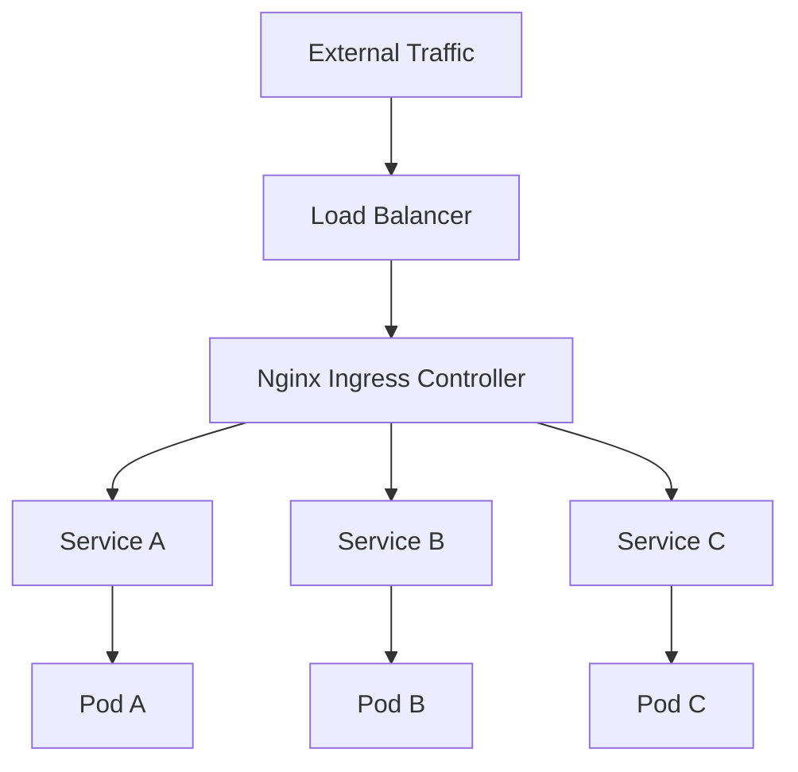

# Ingress NGINX: Statement from the Kubernetes Steering and Security Response Committees

## ① 背景与问题（解决了什么痛点）

在 Kubernetes 生态中，Ingress 是实现对外服务暴露的关键组件。它通过定义规则将外部流量路由到集群内部的服务。而 Ingress NGINX 作为最受欢迎的 Ingress 控制器之一，曾广泛用于生产环境。然而，在 2026 年 3 月，Kubernetes 官方宣布将正式退役 Ingress NGINX。

这一决定背后的原因复杂，但主要涉及以下几点：

- **安全性问题**：随着安全威胁的不断升级，Ingress NGINX 在一些关键漏洞修复上存在滞后。
- **维护成本高**：社区和官方团队对 Ingress NGINX 的支持逐渐减少，导致维护难度加大。
- **技术演进**：新的 Ingress 控制器如 Nginx Ingress Controller（由 Nginx 官方维护）和 Kong Ingress Controller 等提供了更先进的功能和更好的性能。

对于依赖 Ingress NGINX 的企业来说，这无疑是一个重大挑战。如何在不影响业务的前提下完成迁移，是当前最紧迫的问题。

---

## ② 核心概念/技术原理

### 什么是 Ingress？

Ingress 是 Kubernetes 中的一个 API 对象，用于管理对外访问的 HTTP 和 HTTPS 流量。通过定义 Ingress 规则，可以将外部请求路由到集群内的不同服务。

### Ingress NGINX 的工作原理

Ingress NGINX 是一个基于 NGINX 的 Ingress 控制器，其核心组件包括：

- **Controller Pod**：运行 NGINX 代理，负责接收外部请求，并根据 Ingress 规则进行路由。
- **ConfigMap**：存储 NGINX 配置，包括反向代理、SSL 证书等。
- **Service**：将 Ingress 规则映射到后端服务。

当用户访问某个域名时，Ingress 控制器会根据配置文件生成对应的 NGINX 配置，并动态更新以确保流量正确路由。

### 为什么需要替代方案？

随着 Kubernetes 技术的演进，Ingress NGINX 的局限性逐渐显现。例如，它缺乏对 gRPC、WebSockets 等高级协议的支持，且在大规模部署时性能不如其他控制器。

---

## ③ 实战案例/代码示例

### 案例背景

假设你正在维护一个使用 Ingress NGINX 的 Kubernetes 集群，计划在 2026 年 3 月前迁移到 Nginx Ingress Controller。你的目标是：

- 保持现有服务的可用性；
- 最小化停机时间；
- 提供可扩展、安全的新架构。

---

### 1. 准备工作

#### 1.1 安装 Nginx Ingress Controller

Nginx Ingress Controller 是由 Nginx 官方维护的 Ingress 控制器，兼容性更好，且有更活跃的社区支持。

你可以使用 Helm 来安装 Nginx Ingress Controller：

```bash
helm repo add ingress-nginx https://kubernetes.github.io/ingress-nginx
helm repo update
helm install ingress-nginx ingress-nginx/ingress-nginx
```

验证安装是否成功：

```bash
kubectl get pods -n ingress-nginx
```

你应该看到 `ingress-nginx-controller` 的 Pod 处于 `Running` 状态。

---

### 2. 迁移现有 Ingress 规则

#### 2.1 导出现有 Ingress 规则

首先，导出现有的 Ingress 规则：

```bash
kubectl get ingress -o yaml > old-ingresses.yaml
```

然后，查看并分析这些规则，确认哪些需要调整。

#### 2.2 修改 Ingress 配置

Nginx Ingress Controller 的 Ingress 配置与 Ingress NGINX 有所不同，例如：

- 原始 Ingress NGINX 示例：
  
  ```yaml
  apiVersion: networking.k8s.io/v1
  kind: Ingress
  metadata:
    name: example-ingress
    annotations:
      nginx.org/ssl-passthrough: "true"
  spec:
    rules:
    - http:
        paths:
        - path: /api
          pathType: Prefix
          backend:
            service:
              name: api-service
              port:
                number: 80
  ```

- 改为 Nginx Ingress Controller 后，可能需要添加额外注解或修改字段：

  ```yaml
  apiVersion: networking.k8s.io/v1
  kind: Ingress
  metadata:
    name: example-ingress
    annotations:
      nginx.ingress.kubernetes.io/ssl-passthrough: "true"
  spec:
    rules:
    - http:
        paths:
        - path: /api
          pathType: Prefix
          backend:
            service:
              name: api-service
              port:
                number: 80
  ```

注意：某些注解名称可能会发生变化，需查阅 [Nginx Ingress Controller 文档](https://docs.nginx.com/nginx-ingress-controller/)。

---

### 3. 配置 TLS 证书

如果你使用了自签名证书或从 Let's Encrypt 获取的证书，需要将其部署到 Kubernetes 中。

#### 3.1 使用 Secret 存储证书

```bash
kubectl create secret tls my-tls-secret --cert=tls.crt --key=tls.key
```

然后在 Ingress 中引用：

```yaml
spec:
  tls:
  - hosts:
    - example.com
    secretName: my-tls-secret
```

---

### 4. 验证新 Ingress 是否生效

你可以使用 `curl` 或浏览器测试：

```bash
curl -k https://example.com/api
```

如果返回预期结果，则说明迁移成功。

---

### 5. 回滚策略

为了防止迁移过程中出现问题，建议制定回滚策略。例如：

- 在迁移前备份所有 Ingress 规则；
- 在新环境中部署测试服务，验证稳定性；
- 设置监控系统（如 Prometheus + Grafana）监控流量和错误率；
- 如果发现严重问题，可以快速切换回 Ingress NGINX。

---

## ④ 架构设计/方案对比

| 方案 | Ingress NGINX | Nginx Ingress Controller | Kong Ingress Controller |
|------|----------------|--------------------------|-------------------------|
| **维护者** | 社区 | Nginx 官方 | Kong 官方 |
| **性能** | 中等 | 高 | 高 |
| **安全性** | 一般 | 高 | 高 |
| **功能丰富度** | 一般 | 高 | 高 |
| **部署复杂度** | 中 | 低 | 中 |
| **社区支持** | 降低 | 高 | 中 |

### 架构图（Mermaid）



> 上图展示了 Nginx Ingress Controller 如何将外部流量路由到不同的服务。

---

## ⑤ 优劣势评估/选型建议

### 1. Ingress NGINX 的优势

- **成熟稳定**：长期被广泛使用，有丰富的社区资源。
- **易用性强**：配置相对简单，适合初学者。

### 2. Ingress NGINX 的劣势

- **安全风险高**：官方已不再积极维护。
- **功能有限**：不支持最新的 Kubernetes 特性。
- **未来不可持续**：2026 年将完全淘汰。

### 3. Nginx Ingress Controller 的优势

- **官方支持**：由 Nginx 官方维护，安全性更高。
- **性能优化**：支持更多协议，如 gRPC、WebSockets。
- **功能丰富**：提供更多的配置选项和插件。

### 4. Nginx Ingress Controller 的劣势

- **学习曲线稍高**：需要熟悉 Nginx 的配置逻辑。
- **部署略复杂**：需要手动配置部分参数。

### 5. Kong Ingress Controller 的优势

- **API 管理能力强**：支持速率限制、认证等功能。
- **可扩展性强**：可以通过插件扩展功能。
- **适合微服务架构**：适合大型企业级应用。

### 6. Kong Ingress Controller 的劣势

- **配置复杂**：需要了解 Kong 的 API 管理机制。
- **资源消耗较大**：相比 Nginx Ingress Controller，占用更多 CPU 和内存。

---

### 选型建议

| 场景 | 推荐方案 |
|------|-----------|
| 小型项目 | Nginx Ingress Controller |
| 中小型企业 | Nginx Ingress Controller |
| 大型企业 | Kong Ingress Controller |
| 快速迁移 | Nginx Ingress Controller（兼容性好） |
| 需要高级功能 | Kong Ingress Controller（支持 API 管理） |

---

## ⑥ 总结与延伸

Ingress NGINX 的退役标志着 Kubernetes 生态的又一次重要更新。对于依赖该组件的企业而言，及时迁移至更现代的 Ingress 控制器是保障系统稳定性和安全性的关键。

在实际操作中，我们不仅需要关注技术细节，还需要考虑运维流程、团队能力以及未来的扩展性。Nginx Ingress Controller 和 Kong Ingress Controller 分别代表了两种不同的技术路线，选择哪一种取决于具体需求。

此外，随着 AI 和边缘计算的发展，未来的 Ingress 控制器可能会引入更多智能调度、自动扩缩容等功能。因此，保持对新技术的关注和学习，将是每个 DevOps 工程师的重要任务。

---

### 延伸阅读

- [Nginx Ingress Controller 官方文档](https://docs.nginx.com/nginx-ingress-controller/)
- [Kong Ingress Controller 文档](https://docs.konghq.com/kubernetes-ingress-controller/)
- [Kubernetes Ingress 详解](https://kubernetes.io/docs/concepts/services-networking/ingress/)
- [Kubernetes 官方公告：Ingress NGINX 退役声明](https://kubernetes.io/blog/2026/01/29/ingress-nginx-statement/)

---
