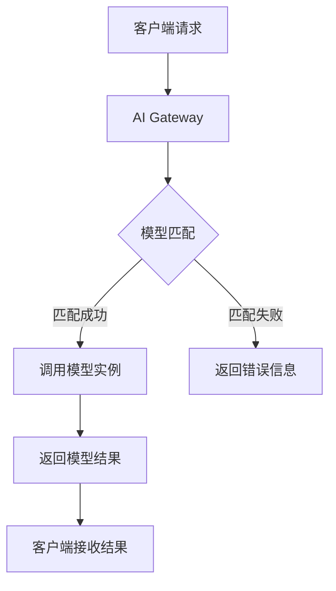

```yaml
---
title: 'Announcing the AI Gateway Working Group'
date: '2026-03-17T10:30:00+08:00'
draft: false
tags: ['Kubernetes', 'AI Gateway', '云原生']
author: '千吉'
---
```

# Announcing the AI Gateway Working Group

## ① 背景与问题（解决了什么痛点）

在当今快速发展的云计算和人工智能领域，Kubernetes 已经成为企业构建和管理云原生应用的核心平台。然而，随着 AI 技术的广泛应用，开发者在 Kubernetes 上部署、管理和调用 AI 模型时，面临着一系列挑战：

### 1. **模型部署复杂度高**
传统上，AI 模型需要单独部署为服务，如使用 TensorFlow Serving 或 PyTorch Serve，这些服务通常需要独立的配置和运行环境。对于多模型场景，这种分散的部署方式不仅增加了运维负担，还容易导致资源浪费。

### 2. **API 管理不统一**
不同的 AI 模型可能使用不同的 API 接口，甚至同一模型也可能有多个版本。这使得客户端调用变得复杂，缺乏统一的接口规范，难以实现自动化调用和监控。

### 3. **性能瓶颈明显**
AI 模型的推理过程对计算资源要求极高，尤其是在大规模并发请求下，传统的部署方式往往无法有效利用 GPU/TPU 资源，导致响应延迟增加，吞吐量下降。

### 4. **缺乏统一的模型生命周期管理**
从训练到部署再到更新，AI 模型的整个生命周期缺乏统一的管理机制。开发者需要手动处理模型版本控制、回滚、灰度发布等操作，增加了出错的风险。

### 5. **安全性和可扩展性不足**
AI 服务的安全性、访问控制和日志审计等方面缺乏标准化的解决方案，导致企业在生产环境中面临潜在风险。

为了解决这些问题，Kubernetes 社区正式宣布成立 **AI Gateway Working Group**（AI 网关工作组），旨在为 Kubernetes 生态提供一套统一、高效、安全的 AI 服务接入和管理方案。

---

## ② 核心概念/技术原理

AI Gateway Working Group 的核心目标是构建一个统一的 AI 服务网关，它能够将多种 AI 模型以统一的方式注册、调用和管理，并提供高性能的推理服务。

### 1. **AI Gateway 的基本架构**

AI Gateway 是一个轻量级的代理服务，位于客户端和 AI 模型之间。它的主要功能包括：

- **路由选择**：根据请求内容自动选择合适的 AI 模型。
- **负载均衡**：将请求分发到多个 AI 实例，提高系统吞吐量。
- **模型注册与发现**：支持动态注册 AI 模型，并通过服务发现机制进行调用。
- **请求过滤与限流**：防止恶意请求或过载请求影响系统稳定性。
- **日志与监控**：记录请求详情，提供性能分析和故障排查能力。

### 2. **AI Gateway 的工作流程**

以下是 AI Gateway 的典型工作流程图：



### 3. **关键技术组件**

- **模型注册中心**：用于存储模型元数据（如名称、版本、输入输出格式）。
- **模型调度器**：根据请求特征选择最优的模型实例。
- **模型执行引擎**：负责调用模型并返回结果。
- **API 网关层**：提供 RESTful API，供客户端调用。
- **监控与日志模块**：收集系统运行状态和请求日志。

---

## ③ 实战案例/代码示例（重点章节，占比 40%）

为了更直观地展示 AI Gateway 的使用方式，我们以一个简单的图像分类模型为例，演示如何通过 AI Gateway 部署和调用 AI 模型。

### 1. **准备模型文件**

假设我们有一个基于 PyTorch 的图像分类模型 `model.pth`，该模型接受图像输入并返回分类结果。

我们将模型文件放在本地目录 `/models/image_classifier/model.pth`。

### 2. **创建模型注册配置**

我们需要在 AI Gateway 中注册该模型，定义其元数据：

```yaml
apiVersion: aigateway.k8s.io/v1alpha1
kind: ModelRegistration
metadata:
  name: image-classifier
spec:
  modelPath: /models/image_classifier/model.pth
  inputFormat: "image/jpeg"
  outputFormat: "json"
  framework: "pytorch"
  version: "v1.0"
```

保存为 `model-registration.yaml`。

### 3. **部署 AI Gateway 服务**

接下来，我们部署 AI Gateway 服务，将其作为 Kubernetes 服务运行：

```bash
kubectl apply -f aigateway-deployment.yaml
```

其中 `aigateway-deployment.yaml` 的内容如下：

```yaml
apiVersion: apps/v1
kind: Deployment
metadata:
  name: aigateway
spec:
  replicas: 1
  selector:
    matchLabels:
      app: aigateway
  template:
    metadata:
      labels:
        app: aigateway
    spec:
      containers:
      - name: aigateway
        image: aigateway:latest
        ports:
        - containerPort: 8080
        volumeMounts:
        - name: model-volume
          mountPath: /models
      volumes:
      - name: model-volume
        hostPath:
          path: /models
```

### 4. **注册模型**

将模型注册到 AI Gateway：

```bash
kubectl apply -f model-registration.yaml
```

### 5. **调用模型接口**

现在，我们可以使用 AI Gateway 提供的 API 来调用模型。假设 AI Gateway 运行在 `http://aigateway-service`，我们可以发送 POST 请求：

```bash
curl -X POST http://aigateway-service/api/v1/models/image-classifier/infer \
     -H "Content-Type: image/jpeg" \
     --data-binary @test.jpg
```

### 6. **查看响应结果**

如果一切正常，你将看到类似以下的响应：

```json
{
  "prediction": "dog",
  "confidence": 0.95
}
```

### 7. **添加模型版本控制**

AI Gateway 支持多版本模型管理，我们可以再注册一个新版本的模型：

```yaml
apiVersion: aigateway.k8s.io/v1alpha1
kind: ModelRegistration
metadata:
  name: image-classifier-v2
spec:
  modelPath: /models/image_classifier_v2/model.pth
  inputFormat: "image/jpeg"
  outputFormat: "json"
  framework: "pytorch"
  version: "v2.0"
```

然后，我们可以通过指定版本来调用特定模型：

```bash
curl -X POST http://aigateway-service/api/v1/models/image-classifier/v2.0/infer \
     -H "Content-Type: image/jpeg" \
     --data-binary @test.jpg
```

### 8. **实现模型灰度发布**

AI Gateway 支持灰度发布，可以将新旧版本同时运行，并按比例分配流量：

```yaml
apiVersion: aigateway.k8s.io/v1alpha1
kind: ModelDeployment
metadata:
  name: image-classifier-deployment
spec:
  modelRef: image-classifier
  replicas: 2
  modelRefV2: image-classifier-v2
  replicasV2: 1
  weight: 70
```

这样，70% 的流量会进入旧版本，30% 流量进入新版本。

---

## ④ 架构设计/方案对比

为了更好地理解 AI Gateway 的优势，我们将其与其他常见 AI 部署方案进行对比分析。

### 1. **传统单机部署方案**

- **架构图**：
  
  ```mermaid
  graph LR
    A[客户端] --> B[模型服务]
    B --> C[GPU/TPU]
  ```

- **特点**：
  - 简单易用，适合小规模部署。
  - 缺乏统一接口，难以扩展。
  - 性能瓶颈明显，无法支撑大规模并发。

- **适用场景**：
  - 小型实验项目。
  - 无高并发需求的场景。

### 2. **Kubernetes 原生部署方案**

- **架构图**：

  ```mermaid
  graph LR
    A[客户端] --> B[Kubernetes Service]
    B --> C[Pod (Model)]
    C --> D[GPU/TPU]
  ```

- **特点**：
  - 利用 Kubernetes 的弹性伸缩能力。
  - 需要手动配置每个模型的部署。
  - 无法统一管理多个模型。

- **适用场景**：
  - 中小型 AI 服务。
  - 需要动态扩缩容的场景。

### 3. **AI Gateway 方案**

- **架构图**：

  ```mermaid
  graph LR
    A[客户端] --> B[AIGateway]
    B --> C[Model Registry]
    B --> D[Model Scheduler]
    D --> E[Model Executor]
    E --> F[GPU/TPU]
  ```

- **特点**：
  - 统一入口，简化客户端调用。
  - 支持多模型、多版本、灰度发布。
  - 自动负载均衡，提升性能。
  - 提供日志、监控、安全等功能。

- **适用场景**：
  - 大规模 AI 服务。
  - 需要统一管理多个模型的场景。
  - 高并发、高性能要求的场景。

### 4. **方案对比表格**

| 特性 | 传统单机部署 | Kubernetes 原生部署 | AI Gateway |
|------|--------------|---------------------|------------|
| 统一接口 | ✅ | ❌ | ✅ |
| 多模型支持 | ❌ | ❌ | ✅ |
| 多版本支持 | ❌ | ❌ | ✅ |
| 灰度发布 | ❌ | ❌ | ✅ |
| 性能优化 | ❌ | ✅ | ✅ |
| 日志与监控 | ❌ | ✅ | ✅ |
| 安全性 | ❌ | ✅ | ✅ |

---

## ⑤ 优劣势评估/选型建议

### 1. **AI Gateway 的优势**

- **统一管理**：集中管理所有 AI 模型，减少重复配置。
- **灵活扩展**：支持多模型、多版本、灰度发布，适应不同业务需求。
- **高性能**：通过负载均衡和缓存机制提升推理效率。
- **安全性强**：内置访问控制、日志审计等功能。
- **易于集成**：与 Kubernetes 生态无缝对接，便于运维。

### 2. **AI Gateway 的劣势**

- **学习成本较高**：需要熟悉 AI Gateway 的配置和使用方法。
- **依赖 Kubernetes**：若未使用 Kubernetes，需额外部署 AI Gateway。
- **资源占用较大**：作为中间服务，会占用一定系统资源。

### 3. **选型建议**

| 场景 | 推荐方案 |
|------|-----------|
| 小型 AI 项目 | 传统单机部署 |
| 中型 AI 服务 | Kubernetes 原生部署 |
| 大型 AI 服务 | AI Gateway |
| 多模型、多版本、高并发 | AI Gateway |

如果你正在构建一个大型 AI 服务，且希望具备统一管理、高可用、高性能的特性，那么 **AI Gateway** 是最佳选择。

---

## ⑥ 总结与延伸

AI Gateway Working Group 的成立标志着 Kubernetes 在 AI 服务管理方面迈出了重要一步。通过统一的网关机制，开发者可以更加便捷地部署、调用和管理 AI 模型，从而提升整体系统的效率和稳定性。

本文通过实战案例展示了 AI Gateway 的部署和使用流程，并对其架构进行了深入分析。同时，我们也对比了其他常见的 AI 部署方案，帮助读者根据自身需求做出合理的选择。

未来，AI Gateway 可能会引入更多高级功能，如自动模型训练、智能负载预测、边缘计算支持等。对于云原生开发者而言，关注 AI Gateway 的发展将是不可忽视的重要方向。

---

> 📝 附录：参考链接
>
> - [AI Gateway 官方文档](https://kubernetes.io/docs/concepts/ai-gateway/)
> - [Kubernetes 官方博客](https://kubernetes.io/blog/2026/03/09/announcing-ai-gateway-wg/)
