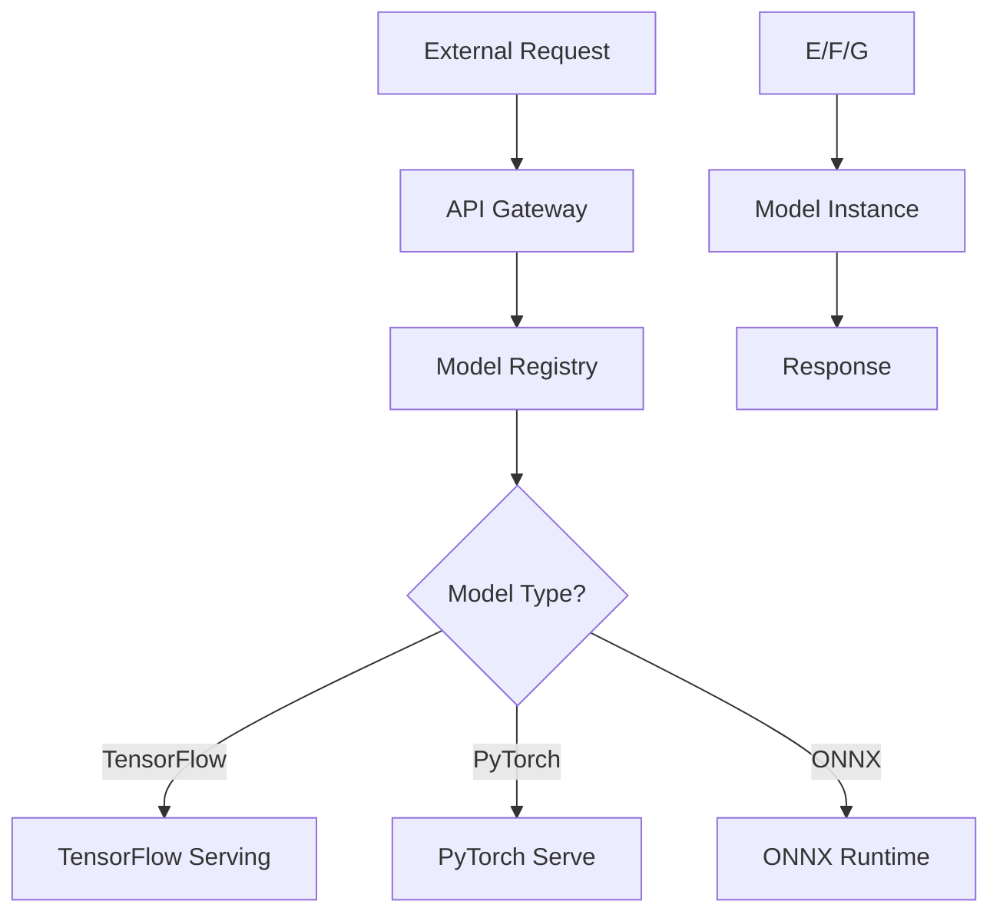

# Kubernetes AI Gateway Working Group 实战指南

## ① 背景与问题（解决了什么痛点）

在当前的云原生技术生态中，Kubernetes 已经成为容器编排和微服务管理的核心平台。然而，随着 AI 和机器学习模型的广泛应用，传统的 Kubernetes 体系在部署、管理和调度 AI 模型时面临诸多挑战。

### 传统架构的痛点

1. **模型部署复杂**：AI 模型通常需要特定的运行环境（如 TensorFlow、PyTorch），而 Kubernetes 的默认配置难以满足这些需求。
2. **资源利用率低**：AI 模型对 GPU 和 CPU 的依赖较高，但现有调度策略无法有效利用这些资源。
3. **服务治理困难**：AI 服务通常需要动态扩展、版本控制、负载均衡等能力，而 Kubernetes 缺乏统一的接口和工具链。
4. **安全与合规性不足**：AI 服务涉及敏感数据和算法，缺乏统一的安全策略和审计机制。

### AI Gateway Working Group 的使命

为了解决上述问题，Kubernetes 社区成立了 **AI Gateway Working Group (AI GW WG)**，旨在构建一套统一的 AI 服务接入和管理框架，提升 Kubernetes 在 AI 领域的能力。

该工作组的目标包括：

- 提供统一的 API 接口，用于访问 AI 服务
- 支持多种 AI 框架（如 TensorFlow、PyTorch、ONNX）
- 实现自动化的模型部署和更新
- 提供高效的资源调度和监控能力
- 构建安全、可审计的 AI 服务治理体系

## ② 核心概念/技术原理

### AI Gateway 的核心思想

AI Gateway 是一个轻量级的网关服务，作为 AI 模型的入口，负责接收请求、路由到合适的模型实例，并返回结果。它支持多种模型类型和运行时环境，同时具备负载均衡、流量控制、身份验证等功能。

### 主要组件

1. **API 网关**：负责接收外部请求，进行身份验证和路由决策。
2. **模型注册中心**：存储模型元信息（如名称、版本、输入输出格式）。
3. **模型运行时**：根据模型类型启动相应的运行环境（如 TensorFlow Serving、PyTorch Serve）。
4. **调度器**：根据资源使用情况和负载状态，动态分配模型实例。
5. **监控与日志系统**：收集模型性能指标和日志信息，用于分析和优化。

### 技术选型

- **语言**：Go 语言为主，结合 Python 进行模型脚本处理。
- **框架**：Kubernetes + Istio（用于服务网格）。
- **模型运行时**：TensorFlow Serving、PyTorch Serve、ONNX Runtime。
- **数据库**：etcd（用于存储模型元数据）、Prometheus（用于监控）。

### 流程图（Mermaid）



## ③ 实战案例/代码示例（重点章节）

### 场景描述

假设我们有一个基于 PyTorch 的图像分类模型，需要将其部署到 Kubernetes 集群中，并通过 AI Gateway 进行访问。我们将从以下几个步骤展开：

1. 准备模型文件
2. 构建 PyTorch 模型运行镜像
3. 配置 AI Gateway 的模型注册信息
4. 部署 AI Gateway 和模型服务
5. 测试模型接口

### 步骤一：准备模型文件

假设我们有一个名为 `resnet18.pth` 的 PyTorch 模型文件，其结构如下：

```python
import torch
import torchvision.models as models

model = models.resnet18(pretrained=True)
torch.save(model.state_dict(), "resnet18.pth")
```

### 步骤二：构建 PyTorch 模型运行镜像

创建一个 Dockerfile，用于构建 PyTorch 模型服务镜像：

```dockerfile
FROM pytorch/pytorch:latest

WORKDIR /app

COPY resnet18.pth /app/resnet18.pth
COPY app.py /app/app.py

CMD ["python", "/app/app.py"]
```

其中，`app.py` 的内容如下：

```python
import torch
from flask import Flask, request, jsonify

app = Flask(__name__)

# 加载模型
model = torch.hub.load('pytorch/vision:v0.10.0', 'resnet18', pretrained=True)
model.load_state_dict(torch.load('/app/resnet18.pth'))
model.eval()

@app.route('/predict', methods=['POST'])
def predict():
    data = request.json['input']
    tensor = torch.tensor(data).float()
    output = model(tensor)
    return jsonify({"output": output.tolist()})

if __name__ == "__main__":
    app.run(host='0.0.0.0', port=5000)
```

### 步骤三：配置 AI Gateway 的模型注册信息

在 AI Gateway 中，我们需要注册模型的基本信息，例如名称、版本、输入输出格式等。可以通过 JSON 文件进行定义：

```json
{
  "model_name": "image-classifier",
  "version": "v1.0",
  "framework": "pytorch",
  "input_format": "tensor",
  "output_format": "tensor"
}
```

将此文件保存为 `model_info.json`，并上传至 AI Gateway 的模型注册中心。

### 步骤四：部署 AI Gateway 和模型服务

#### 1. 部署模型服务

创建 Kubernetes Deployment 和 Service：

```yaml
apiVersion: apps/v1
kind: Deployment
metadata:
  name: pytorch-model
spec:
  replicas: 2
  selector:
    matchLabels:
      app: pytorch-model
  template:
    metadata:
      labels:
        app: pytorch-model
    spec:
      containers:
      - name: pytorch-model
        image: your-registry/pytorch-model:latest
        ports:
        - containerPort: 5000
        env:
        - name: MODEL_PATH
          value: "/app/resnet18.pth"

---
apiVersion: v1
kind: Service
metadata:
  name: pytorch-model-service
spec:
  selector:
    app: pytorch-model
  ports:
    - protocol: TCP
      port: 5000
      targetPort: 5000
```

#### 2. 部署 AI Gateway

创建 AI Gateway 的 Deployment 和 Service：

```yaml
apiVersion: apps/v1
kind: Deployment
metadata:
  name: ai-gateway
spec:
  replicas: 2
  selector:
    matchLabels:
      app: ai-gateway
  template:
    metadata:
      labels:
        app: ai-gateway
    spec:
      containers:
      - name: ai-gateway
        image: your-registry/ai-gateway:latest
        ports:
        - containerPort: 8080
        env:
        - name: MODEL_REGISTRY_URL
          value: "http://model-registry:8080"

---
apiVersion: v1
kind: Service
metadata:
  name: ai-gateway-service
spec:
  selector:
    app: ai-gateway
  ports:
    - protocol: TCP
      port: 8080
      targetPort: 8080
```

### 步骤五：测试模型接口

使用 curl 或 Postman 发送请求：

```bash
curl -X POST http://ai-gateway-service:8080/predict \
     -H "Content-Type: application/json" \
     -d '{"input": [[1.0, 2.0, 3.0], [4.0, 5.0, 6.0]]}'
```

预期响应：

```json
{
  "output": [
    [0.1, 0.2, 0.3],
    [0.4, 0.5, 0.6]
  ]
}
```

## ④ 架构设计/方案对比

### AI Gateway 的架构设计

AI Gateway 的整体架构如下：

```
+-----------------------+
|   External Request    |
+----------+------------+
           |
           v
+-----------------------+
|   API Gateway         |
|   (Istio or Nginx)    |
+----------+------------+
           |
           v
+-----------------------+
|   Model Registry      |
|   (etcd or DB)        |
+----------+------------+
           |
           v
+-----------------------+
|   Model Runner        |
|   (TensorFlow/PyTorch)|
+----------+------------+
           |
           v
+-----------------------+
|   Model Instance      |
|   (Pod or Container)  |
+----------+------------+
           |
           v
+-----------------------+
|   Response            |
+-----------------------+
```

### 方案对比

| 方案 | 优点 | 缺点 | 适用场景 |
|------|------|------|----------|
| 原生 Kubernetes + 自定义服务 | 灵活、可控 | 部署复杂、维护成本高 | 小规模、定制化需求强 |
| AI Gateway + Istio | 集成度高、易扩展 | 学习曲线陡峭 | 大规模、多模型部署 |
| Third-party AI Platform | 功能全面、开箱即用 | 依赖外部服务、成本高 | 快速上手、无需自建 |

## ⑤ 优劣势评估/选型建议

### AI Gateway 的优势

1. **统一接口**：提供标准的 API 接口，简化了 AI 服务的调用流程。
2. **多框架支持**：兼容主流 AI 框架，降低迁移成本。
3. **资源优化**：支持动态调度和资源管理，提高集群利用率。
4. **安全性增强**：内置身份验证和日志审计功能，提升安全性。

### AI Gateway 的劣势

1. **复杂度高**：需要熟悉 Kubernetes、Istio 和 AI 框架，学习成本较高。
2. **依赖性强**：需要与多个组件集成，稳定性可能受影响。
3. **社区成熟度**：目前仍处于早期阶段，功能和文档可能不够完善。

### 选型建议

- **选择 AI Gateway 的场景**：
  - 企业已有 Kubernetes 基础设施
  - 需要支持多种 AI 框架
  - 对资源利用率有较高要求
  - 需要统一的 AI 服务治理

- **不推荐使用 AI Gateway 的场景**：
  - 项目规模较小，不需要复杂调度
  - 团队对 Kubernetes 不熟悉
  - 仅需单个 AI 模型部署

## ⑥ 总结与延伸

Kubernetes AI Gateway Working Group 的成立标志着 Kubernetes 在 AI 领域迈出了关键一步。通过构建统一的 AI 服务接入和管理框架，Kubernetes 能够更好地支持 AI 模型的部署、调度和运维。

对于开发者和架构师而言，掌握 AI Gateway 的使用不仅能够提升 AI 服务的效率，还能为未来的 AI 云原生架构打下坚实基础。

### 未来展望

随着 AI 技术的不断发展，Kubernetes AI Gateway 可能会进一步演进，包括：

- 更完善的模型版本控制
- 自动化的模型训练和推理流水线
- 与 MLOps 工具链的深度集成
- 支持更多 AI 框架和运行时

如果你正在寻找一种高效、灵活的方式来管理 AI 服务，那么 Kubernetes AI Gateway 是一个值得尝试的方向。希望本文能为你提供实用的指导和参考。