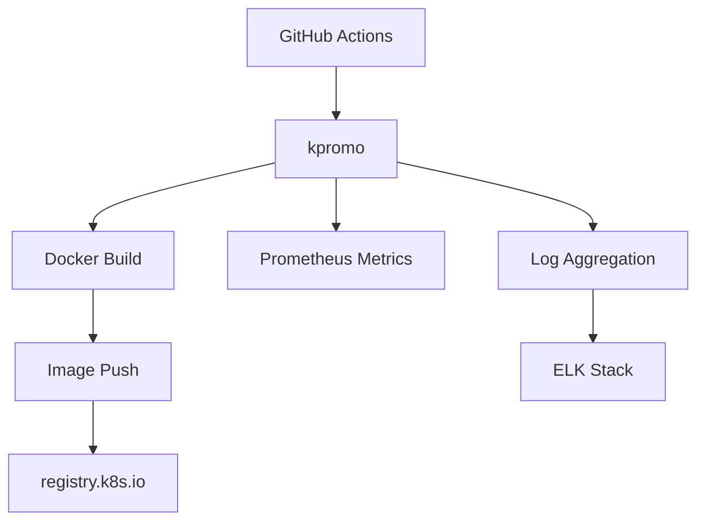

# The Invisible Rewrite: Modernizing the Kubernetes Image Promoter

## ① 背景与问题（解决了什么痛点）

在 Kubernetes 生态中，容器镜像的发布和管理是一个核心环节。所有从 `registry.k8s.io` 拉取的镜像，都通过一个名为 `kpromo` 的工具进行“推广”（Promotion）。这个工具在过去几年中扮演了关键角色，但随着 Kubernetes 生态的不断扩展，它也暴露出了一些明显的瓶颈。

### 传统 kpromo 的局限性

1. **流程复杂**：传统的 kpromo 流程需要手动触发、依赖特定脚本、缺乏自动化。
2. **版本控制困难**：镜像版本管理和标签策略不够灵活，难以适应多分支开发模式。
3. **可维护性差**：代码结构松散，测试覆盖率低，导致维护成本高。
4. **性能瓶颈**：在大规模镜像推送时，效率低下，容易出现超时或失败。

这些问题使得 kpromo 在面对日益增长的镜像数量和更复杂的 CI/CD 流程时显得力不从心。因此，Kubernetes 社区决定对其进行重构，以提升其稳定性、可扩展性和用户体验。

### 重构的目标

本次重构的核心目标是：

- 实现自动化镜像推广流程；
- 提供更清晰的版本控制机制；
- 增强可维护性和可观测性；
- 支持更广泛的使用场景和集成能力。

---

## ② 核心概念/技术原理

新的 kpromo 工具基于 Go 语言实现，采用了模块化设计，结合了现代 CI/CD 工具链的优势。其核心功能包括：

### 1. 镜像推广流程（Image Promotion Flow）

推广流程主要包括以下几个阶段：

1. **构建阶段**：在 CI 系统中构建镜像，并打上合适的标签（如 `v1.25.0`）。
2. **验证阶段**：对镜像进行基本的健康检查和完整性验证。
3. **推广阶段**：将镜像推送到 `registry.k8s.io`，并更新相关元数据。
4. **记录阶段**：记录推广过程中的日志和状态信息，便于后续追踪和审计。

### 2. 配置驱动（Config-Driven）

新 kpromo 强调配置驱动的设计理念，用户可以通过 YAML 文件定义推广规则、镜像标签策略、推送目标等。

```yaml
# config.yaml
promotions:
  - image: my-image
    tag: v1.0.0
    target: registry.k8s.io/my-group/my-image
    labels:
      - "release=stable"
      - "arch=amd64"
```

### 3. 可观测性（Observability）

新版本增加了丰富的日志输出和 Prometheus 监控指标，支持对推广过程进行实时监控和告警。

### 4. 安全增强（Security Enhancements）

- 基于 OIDC 的身份认证；
- 支持镜像签名（Signature Verification）；
- 更严格的权限控制策略。

---

## ③ 实战案例/代码示例（重点章节，占比 40%）

### 场景：在 GitHub Actions 中使用新 kpromo 推送镜像

#### 步骤一：准备环境

首先，确保你的项目中包含以下内容：

- 一个 Dockerfile
- 一个 `config.yaml` 文件，定义推广规则
- 一个 GitHub Actions workflow 文件

#### 步骤二：编写 config.yaml

```yaml
# config.yaml
promotions:
  - image: my-app
    tag: latest
    target: registry.k8s.io/my-group/my-app
    labels:
      - "release=latest"
      - "arch=amd64"
    annotations:
      description: "My application for Kubernetes"
```

#### 步骤三：编写 GitHub Actions Workflow

```yaml
# .github/workflows/promote.yml
name: Promote Image

on:
  push:
    branches:
      - main

jobs:
  promote:
    runs-on: ubuntu-latest
    steps:
      - name: Checkout code
        uses: actions/checkout@v3

      - name: Set up Docker Buildx
        uses: docker/setup-buildx-action@v2

      - name: Build and Push Image
        run: |
          docker build -t my-app .
          docker tag my-app registry.k8s.io/my-group/my-app:latest
          docker push registry.k8s.io/my-group/my-app:latest

      - name: Run kpromo
        run: |
          # 下载并运行 kpromo
          curl -L https://github.com/kubernetes-sigs/promo-tools/releases/download/v2.0.0/kpromo-linux-amd64 -o kpromo
          chmod +x kpromo
          ./kpromo --config=config.yaml
```

> 注意：实际部署中需配置正确的认证凭据，如使用 GitHub Secret 存储 `DOCKER_REGISTRY_USER` 和 `DOCKER_REGISTRY_PASSWORD`。

#### 步骤四：查看推广结果

运行完成后，你可以通过以下命令查看镜像是否成功推广到 `registry.k8s.io`：

```bash
docker pull registry.k8s.io/my-group/my-app:latest
```

同时，你可以在 Prometheus 中查看 kpromo 的监控指标，确认推广任务是否成功完成。

---

## ④ 架构设计/方案对比

### 新 kpromo 的架构图（Mermaid）



### 对比分析：旧 kpromo vs 新 kpromo

| 特性 | 旧 kpromo | 新 kpromo |
|------|-----------|-----------|
| 构建方式 | 手动/脚本 | 自动化/CI/CD 集成 |
| 配置方式 | 内置逻辑 | YAML 配置文件 |
| 日志系统 | 简单日志 | Prometheus + ELK |
| 权限控制 | 基础权限 | OIDC + RBAC |
| 镜像标签策略 | 固定 | 灵活可配置 |
| 可维护性 | 低 | 高 |
| 性能 | 一般 | 优化 |

### 选型建议

如果你正在使用 Kubernetes 生态中的镜像管理工具，建议根据以下情况选择方案：

- **小规模团队 / 单一镜像**：可以继续使用旧 kpromo，但应尽快迁移到新版本。
- **中大型团队 / 多分支开发**：强烈推荐使用新 kpromo，以提高效率和可维护性。
- **需要高级安全特性**：新 kpromo 提供了更强的安全保障，适合企业级部署。

---

## ⑤ 优劣势评估/选型建议

### 优势

1. **自动化程度高**：通过 CI/CD 集成，实现端到端自动化推广流程。
2. **配置灵活**：支持 YAML 配置，易于定制和扩展。
3. **可观测性强**：集成 Prometheus 和日志系统，便于监控和故障排查。
4. **安全性增强**：支持 OIDC 认证和镜像签名，提升镜像可信度。
5. **可维护性好**：模块化设计，代码结构清晰，便于长期维护。

### 劣势

1. **学习曲线略高**：相比旧版本，新 kpromo 需要一定的配置和理解。
2. **依赖较多**：需要配合 CI/CD 工具、Prometheus、ELK 等组件。
3. **初期迁移成本**：已有旧流程的团队需要一定时间进行迁移和适配。

### 避坑指南

- **避免直接替换旧流程**：新 kpromo 不是简单的“升级”，而是“重构”，建议逐步迁移。
- **不要忽略配置文件**：YAML 配置是新 kpromo 的核心，务必仔细编写。
- **注意权限配置**：确保镜像推送和拉取的权限正确，避免因权限问题导致失败。
- **定期更新配置**：随着项目发展，及时调整推广策略和标签规则。

---

## ⑥ 总结与延伸

Kubernetes 社区对 kpromo 的重构是一次重要的技术升级，不仅提升了镜像推广的效率和可靠性，也为开发者提供了更灵活、更强大的工具。通过实战案例可以看出，新 kpromo 在自动化、配置灵活性、可观测性和安全性方面都有显著提升。

对于 Kubernetes 用户来说，掌握新 kpromo 的使用方法，是提升镜像管理能力的关键一步。未来，随着更多 CI/CD 工具的集成和生态的完善，kpromo 将成为 Kubernetes 镜像管理的标配工具。

### 延伸阅读

- [官方文档](https://kubernetes.io/docs/concepts/cluster-administration/manage-images/)
- [kpromo GitHub 仓库](https://github.com/kubernetes-sigs/promo-tools)
- [Docker 官方文档](https://docs.docker.com/)
- [Prometheus 官方文档](https://prometheus.io/docs/introduction/overview/)

希望本文能够帮助你在 Kubernetes 镜像管理中更加得心应手，推动你的项目更快、更稳定地发展。
