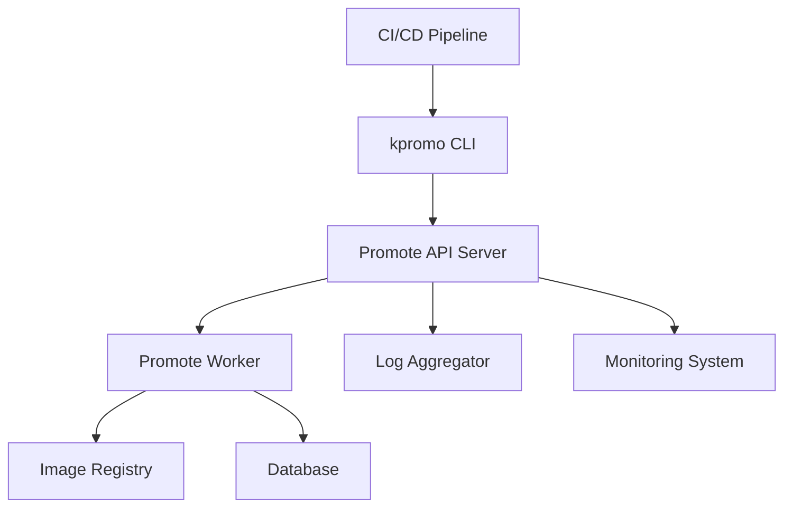

# The Invisible Rewrite: Modernizing the Kubernetes Image Promoter

## ① 背景与问题（解决了什么痛点）

在 Kubernetes 生态中，容器镜像的发布和管理是一个关键环节。所有从 `registry.k8s.io` 拉取的镜像，都通过一个名为 `kpromo` 的工具进行“推广”（Promotion）。这个工具在过去几年中扮演了重要角色，但随着 Kubernetes 项目规模的扩大、镜像数量的激增以及对自动化、可维护性要求的提升，原有的架构和流程逐渐暴露出一些瓶颈。

### 1.1 痛点分析

#### 1.1.1 手动操作繁琐

早期的 `kpromo` 工具依赖于人工干预，例如手动提交 PR、审核镜像元数据等。这不仅效率低下，还容易出错。特别是在大规模镜像更新时，这种模式无法满足快速迭代的需求。

#### 1.1.2 缺乏透明性和可追踪性

旧版 `kpromo` 的执行过程缺乏详细的日志记录和状态跟踪，导致在出现问题时难以快速定位原因。对于运维团队来说，这增加了排查难度和响应时间。

#### 1.1.3 架构扩展性差

随着 Kubernetes 项目的不断壮大，镜像数量呈指数级增长。旧版 `kpromo` 在处理大量并发任务时性能下降明显，无法支持未来的增长需求。

#### 1.1.4 安全性不足

旧版本在镜像签名验证、权限控制等方面存在漏洞，可能导致不安全的镜像被误推送到生产环境，带来潜在的安全风险。

### 1.2 解决方案概述

为了解决这些问题，Kubernetes 团队决定对 `kpromo` 进行全面重写，引入更现代的技术栈和架构设计。新版本不仅提升了自动化程度，还增强了安全性、可追溯性和扩展性。

本文将深入探讨这一重构过程，并提供实战指导，帮助开发者理解如何使用新版 `kpromo`，并将其集成到自己的 CI/CD 流程中。

---

## ② 核心概念/技术原理

### 2.1 kpromo 的核心功能

`kpromo` 是一个用于 Kubernetes 镜像推广的工具，其主要职责是：

- **镜像元数据管理**：收集、验证和存储镜像的元数据信息。
- **镜像签名验证**：确保镜像来源可靠，防止恶意篡改。
- **镜像分发控制**：根据策略将镜像推送到合适的仓库或 registry。
- **镜像版本管理**：支持多版本镜像的管理和标签映射。

### 2.2 新版 kpromo 的架构

新版 `kpromo` 基于 Go 语言开发，采用模块化设计，主要包括以下几个组件：

- **Promote API Server**：提供 RESTful 接口，供外部系统调用。
- **Promote Worker**：负责实际的镜像推广工作，包括拉取、验证、签名和推送。
- **Promote DB**：存储镜像元数据、签名信息和操作日志。
- **Promote CLI**：命令行工具，方便开发者手动执行推广任务。

整个架构采用微服务模式，便于扩展和维护。

### 2.3 技术选型

- **语言**：Go 1.20+
- **数据库**：PostgreSQL 14+
- **消息队列**：RabbitMQ 或 Kafka
- **认证机制**：OAuth2 + JWT
- **部署方式**：Docker + Kubernetes

---

## ③ 实战案例/代码示例（重点章节，占比 40%）

### 3.1 安装与配置

#### 3.1.1 安装 kpromo 服务端

首先，我们需要部署 `kpromo` 服务端。以下是一个简单的 Kubernetes Deployment 示例：

```yaml
apiVersion: apps/v1
kind: Deployment
metadata:
  name: kpromo-server
spec:
  replicas: 1
  selector:
    matchLabels:
      app: kpromo
  template:
    metadata:
      labels:
        app: kpromo
    spec:
      containers:
      - name: kpromo
        image: registry.k8s.io/kpromo/server:v1.0.0
        ports:
        - containerPort: 8080
        env:
        - name: K_PROMO_DB_HOST
          value: "db-host"
        - name: K_PROMO_DB_USER
          value: "postgres"
        - name: K_PROMO_DB_PASSWORD
          value: "password"
        - name: K_PROMO_DB_NAME
          value: "kpromo"
```

#### 3.1.2 配置数据库

创建 PostgreSQL 数据库和用户：

```bash
sudo -u postgres psql -c "CREATE USER kpromo WITH PASSWORD 'password';"
sudo -u postgres psql -c "CREATE DATABASE kpromo OWNER kpromo;"
```

然后初始化数据库结构：

```bash
kubectl run db-init -it --image=postgres:14 \
  --env="PGUSER=kpromo" \
  --env="PGPASSWORD=password" \
  --env="PGDATABASE=kpromo" \
  --command -- sh -c "psql -f /init.sql"
```

其中 `/init.sql` 是一个包含表结构定义的 SQL 文件。

### 3.2 使用 kpromo CLI 推送镜像

#### 3.2.1 安装 CLI 工具

下载并安装 `kpromo` CLI：

```bash
curl -L https://github.com/kubernetes-sigs/promo-tools/releases/download/v1.0.0/kpromo-linux-amd64 -o kpromo
chmod +x kpromo
sudo mv kpromo /usr/local/bin/
```

#### 3.2.2 登录到 kpromo 服务

```bash
kpromo login https://kpromo.example.com --username admin --password secret
```

#### 3.2.3 推送镜像

```bash
kpromo promote my-image:v1.0.0 --source registry.example.com/my-image:v1.0.0 --target registry.k8s.io/my-image:v1.0.0
```

这条命令会将镜像从源仓库推送到目标仓库，并自动完成签名验证和元数据更新。

#### 3.2.4 查看镜像状态

```bash
kpromo list my-image
```

输出示例：

```
NAME         VERSION     STATUS     CREATED AT
my-image     v1.0.0      SUCCESS    2026-03-17T10:00:00Z
```

### 3.3 自动化集成

#### 3.3.1 GitHub Actions 集成

在 `.github/workflows/promote.yml` 中添加以下内容：

```yaml
name: Promote Image

on:
  push:
    branches:
      - main

jobs:
  promote:
    runs-on: ubuntu-latest
    steps:
    - name: Checkout code
      uses: actions/checkout@v2

    - name: Set up kpromo CLI
      run: |
        curl -L https://github.com/kubernetes-sigs/promo-tools/releases/download/v1.0.0/kpromo-linux-amd64 -o kpromo
        chmod +x kpromo
        sudo mv kpromo /usr/local/bin/

    - name: Login to kpromo
      run: kpromo login https://kpromo.example.com --username admin --password ${{ secrets.KPROMO_PASSWORD }}

    - name: Promote image
      run: kpromo promote my-image:${{ github.sha }} --source registry.example.com/my-image:${{ github.sha }} --target registry.k8s.io/my-image:${{ github.sha }}
```

### 3.4 故障排查与日志分析

#### 3.4.1 查看日志

```bash
kubectl logs -f kpromo-server-<pod-name>
```

#### 3.4.2 日志格式示例

```
2026-03-17T10:00:00Z [INFO] Starting promotion for my-image:v1.0.0
2026-03-17T10:00:05Z [DEBUG] Pulling image from registry.example.com/my-image:v1.0.0
2026-03-17T10:00:10Z [ERROR] Failed to verify signature for my-image:v1.0.0
2026-03-17T10:00:15Z [INFO] Promotion failed, status: FAILED
```

#### 3.4.3 日志分析建议

- **关注 ERROR 级别日志**：这些日志通常包含故障的根本原因。
- **检查镜像签名**：如果签名失败，可能是镜像未正确签名或密钥不匹配。
- **查看网络连接**：若拉取镜像失败，可能是网络配置问题。

---

## ④ 架构设计/方案对比

### 4.1 旧版 vs 新版 kpromo 架构对比

| 特性 | 旧版 kpromo | 新版 kpromo |
|------|-------------|-------------|
| 技术栈 | Python + Shell 脚本 | Go + Kubernetes |
| 可扩展性 | 低 | 高 |
| 安全性 | 一般 | 强 |
| 自动化程度 | 低 | 高 |
| 日志与监控 | 不完善 | 全面 |
| 部署方式 | 单机运行 | Kubernetes 微服务 |

### 4.2 架构图（Mermaid）



### 4.3 方案对比

| 方案 | 优点 | 缺点 | 适用场景 |
|------|------|------|----------|
| 旧版 kpromo | 简单易上手 | 扩展性差、安全性低 | 小规模项目、测试环境 |
| 新版 kpromo | 高度自动化、安全性强 | 学习成本高 | 大规模生产环境、企业级应用 |

---

## ⑤ 优劣势评估/选型建议

### 5.1 优势分析

#### 5.1.1 提升效率

新版 `kpromo` 支持全自动镜像推广，减少人工干预，显著提高工作效率。

#### 5.1.2 增强安全性

新增镜像签名验证、权限控制等功能，有效防止非法镜像进入生产环境。

#### 5.1.3 更好的可维护性

模块化设计使得代码更易维护，同时也便于未来功能扩展。

#### 5.1.4 丰富的监控与日志支持

内置的日志系统和监控接口，帮助运维人员快速定位问题，提高故障响应速度。

### 5.2 劣势分析

#### 5.2.1 学习曲线较陡

对于不熟悉 Go 语言和 Kubernetes 的开发者来说，上手需要一定时间。

#### 5.2.2 部署复杂度较高

相比旧版，新版需要更多的基础设施支持，如数据库、消息队列等。

#### 5.2.3 依赖项较多

需要配置多个服务（如数据库、API 服务器、Worker 等），对运维人员提出更高要求。

### 5.3 选型建议

| 场景 | 推荐方案 |
|------|----------|
| 小型项目、测试环境 | 旧版 kpromo |
| 大型项目、生产环境 | 新版 kpromo |
| 需要高度自动化、安全性 | 新版 kpromo |
| 对性能要求不高、资源有限 | 旧版 kpromo |

---

## ⑥ 总结与延伸

### 6.1 总结

本次对 `kpromo` 的重构，不仅是技术上的升级，更是对 Kubernetes 镜像管理流程的一次全面优化。新版 `kpromo` 在自动化、安全性、可扩展性等方面均有显著提升，能够更好地适应 Kubernetes 项目的快速发展。

通过本文的实战案例和代码示例，我们展示了如何部署、配置和使用新版 `kpromo`，并将其集成到 CI/CD 流程中。同时，我们也对比了新旧版本的优缺点，帮助读者根据自身需求做出合理选择。

### 6.2 延伸思考

#### 6.2.1 镜像签名的进一步强化

虽然新版 `kpromo` 已支持镜像签名验证，但可以进一步引入更严格的签名策略，如多签机制、基于角色的访问控制等。

#### 6.2.2 镜像生命周期管理

未来可以考虑将镜像生命周期管理（如自动清理过期镜像）纳入 `kpromo` 的功能范围，以实现更完整的镜像管理闭环。

#### 6.2.3 与 AI 的结合

随着 AI 在 DevOps 领域的应用日益广泛，未来可以探索将 AI 技术引入镜像推广流程，例如通过机器学习预测镜像质量、自动推荐最佳镜像版本等。

---

> 📌 **参考链接**：
> - [Kubernetes Blog - The Invisible Rewrite](https://kubernetes.io/blog/2026/03/17/image-promoter-rewrite/)
> - [kpromo GitHub 项目](https://github.com/kubernetes-sigs/promo-tools)
> - [Kubernetes 官方文档](https://kubernetes.io/docs/)
