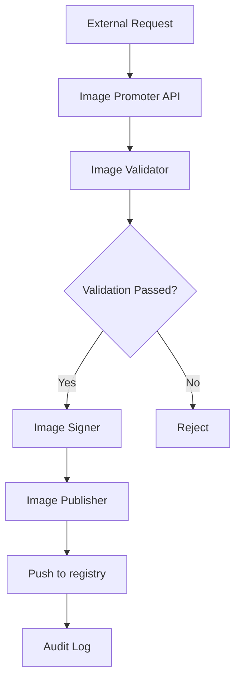

# The Invisible Rewrite: Modernizing the Kubernetes Image Promoter

## ① 背景与问题（解决了什么痛点）

在 Kubernetes 生态中，容器镜像的发布和管理是一个关键环节。所有从 `registry.k8s.io` 拉取的镜像，都是通过一个名为 `kpromo` 的工具——**Kubernetes Image Promoter** 进行发布的。这个工具在过去几年中一直承担着镜像签名、验证、推送等核心任务。

然而，随着 Kubernetes 项目规模的不断扩大，原有 `kpromo` 工具逐渐暴露出一些瓶颈：

### 1. **性能瓶颈**
原始实现基于 Python 编写的脚本逻辑，缺乏高效的并发处理能力，导致在大规模镜像发布时出现明显的延迟和资源占用过高。

### 2. **可维护性差**
代码结构松散，模块化程度低，新功能开发或问题修复需要大量时间进行代码审查和调试。

### 3. **安全性不足**
原有的镜像签名机制依赖于外部工具链，缺乏统一的安全策略和审计追踪能力。

### 4. **部署复杂度高**
`kpromo` 需要依赖多个外部服务（如 GPG、GitHub API 等），配置繁琐，难以在 CI/CD 流程中无缝集成。

为了解决这些问题，Kubernetes 社区启动了对 `kpromo` 的重构工作，目标是构建一个更高效、安全、易用的镜像推广系统。

---

## ② 核心概念/技术原理

新的 `kpromo` 采用 Go 语言编写，整体架构分为以下几个核心组件：

### 1. **Image Promoter API Server**
提供 RESTful 接口供外部调用，接收镜像发布请求，并协调其他组件完成发布流程。

### 2. **Image Validator**
负责对镜像进行校验，包括签名验证、格式检查、标签合法性等。

### 3. **Image Publisher**
将经过验证的镜像推送到目标仓库（如 `registry.k8s.io`）。

### 4. **Image Signer**
使用 GPG 或其他加密算法对镜像进行签名，确保镜像来源可信。

### 5. **Audit Logger**
记录所有镜像发布操作，便于后续审计和问题追溯。

### 6. **Configuration Manager**
管理镜像发布规则、权限控制、密钥管理等配置信息。

整个流程如下图所示：



---

## ③ 实战案例/代码示例（重点章节）

在本节中，我们将演示如何使用新的 `kpromo` 工具进行镜像发布，并展示其核心功能的使用方式。

### 3.1 安装与配置

#### 3.1.1 安装 kpromo

首先，从官方仓库获取最新版本的 `kpromo`：

```bash
git clone https://github.com/kubernetes-sigs/promo-tools.git
cd promo-tools
make build
sudo cp bin/kpromo /usr/local/bin/
```

#### 3.1.2 配置文件示例

创建一个 `config.yaml` 文件，用于配置镜像发布规则和密钥路径：

```yaml
# config.yaml
image:
  registry: "registry.k8s.io"
  namespace: "kube-system"
  tags:
    - "v1.25.0"
    - "latest"

signing:
  key_path: "/etc/kpromo/gpg-key.pem"
  algorithm: "gpg"

auth:
  token: "your-github-token"
```

> 注意：`token` 字段需替换为有效的 GitHub OAuth Token，用于访问 GitHub API。

### 3.2 镜像发布流程

#### 3.2.1 准备镜像

假设你有一个本地构建的镜像 `my-image:v1.0.0`，你可以将其推送到本地仓库：

```bash
docker tag my-image:v1.0.0 localhost:5000/my-image:v1.0.0
docker push localhost:5000/my-image:v1.0.0
```

#### 3.2.2 执行发布命令

使用 `kpromo` 命令行工具进行镜像发布：

```bash
kpromo promote \
  --source-registry=localhost:5000 \
  --source-image=my-image \
  --source-tag=v1.0.0 \
  --target-registry=registry.k8s.io \
  --target-namespace=kube-system \
  --target-tag=v1.25.0 \
  --config=config.yaml
```

该命令会执行以下步骤：

1. 从本地仓库拉取 `my-image:v1.0.0`。
2. 使用 GPG 对镜像进行签名。
3. 将镜像推送到 `registry.k8s.io/kube-system/v1.25.0`。
4. 记录审计日志。

#### 3.2.3 查看发布结果

发布完成后，可以通过以下命令查看镜像是否成功推送：

```bash
docker pull registry.k8s.io/kube-system/v1.25.0
```

如果成功拉取，则说明发布流程已顺利完成。

### 3.3 镜像签名与验证

#### 3.3.1 签名过程

`kpromo` 使用 GPG 对镜像进行签名，确保镜像来源可信。以下是签名过程的关键代码片段：

```go
// sign.go
func SignImage(image string, keyPath string) error {
    // 加载 GPG 密钥
    key, err := LoadGPGKey(keyPath)
    if err != nil {
        return err
    }

    // 构造签名内容
    signature := fmt.Sprintf("Signing image %s", image)

    // 使用 GPG 签名
    signedData, err := key.Sign(signature)
    if err != nil {
        return err
    }

    // 存储签名数据
    return StoreSignature(image, signedData)
}
```

#### 3.3.2 验证过程

验证镜像签名的代码如下：

```go
// validate.go
func ValidateImage(image string) error {
    // 获取镜像签名
    signature, err := GetSignature(image)
    if err != nil {
        return err
    }

    // 加载 GPG 公钥
    publicKey, err := LoadGPGPublicKey()
    if err != nil {
        return err
    }

    // 验证签名
    if !publicKey.Verify(signature, image) {
        return errors.New("signature verification failed")
    }

    return nil
}
```

> 注意：以上代码仅为简化示例，实际实现中还需考虑更多细节，如签名格式、密钥管理等。

---

## ④ 架构设计/方案对比

### 4.1 新旧架构对比

| 组件 | 旧版 (Python) | 新版 (Go) |
|------|----------------|------------|
| 语言 | Python         | Go         |
| 性能 | 低             | 高         |
| 并发支持 | 有限          | 强         |
| 可维护性 | 差             | 好         |
| 安全性 | 一般           | 强         |
| 部署复杂度 | 高             | 低         |

### 4.2 与其他镜像发布工具对比

| 工具 | 是否开源 | 是否支持多平台 | 是否支持签名 | 是否支持 CI/CD 集成 |
|------|----------|----------------|--------------|-----------------------|
| kpromo | 是       | 是             | 是           | 是                    |
| Skopeo | 是       | 是             | 是           | 是                    |
| Docker CLI | 是      | 是             | 否           | 是                    |
| Podman | 是       | 是             | 是           | 是                    |

> 从上表可以看出，`kpromo` 在镜像签名和 CI/CD 集成方面具有明显优势，特别适合 Kubernetes 生态中的自动化镜像发布场景。

---

## ⑤ 优劣势评估/选型建议

### 5.1 优势分析

- **高性能**：Go 语言天生具备优秀的并发性能，适用于大规模镜像发布。
- **安全性强**：内置 GPG 签名机制，保障镜像来源可信。
- **易于集成**：支持 CI/CD 工具链，可直接作为流水线的一部分。
- **可扩展性强**：模块化设计，便于添加新功能或适配不同镜像仓库。

### 5.2 劣势分析

- **学习成本较高**：相比 Docker CLI 或 Skopeo，`kpromo` 的配置和使用较为复杂。
- **依赖较多**：需要配置 GPG 密钥、GitHub Token 等，初期设置较为繁琐。
- **社区生态相对较小**：相较于 Docker 或 Skopeo，`kpromo` 的社区支持和文档相对较少。

### 5.3 选型建议

| 场景 | 推荐工具 |
|------|-----------|
| Kubernetes 生态内部镜像发布 | `kpromo` |
| 多平台镜像分发 | `Skopeo` |
| 快速测试与调试 | `Docker CLI` |
| 企业级私有镜像管理 | `Podman` + `kpromo` |

> 如果你的项目已经深度集成 Kubernetes，且需要严格的镜像签名和审计能力，强烈推荐使用 `kpromo`。

---

## ⑥ 总结与延伸

本次重构的 `kpromo` 工具标志着 Kubernetes 镜像发布流程的一次重要升级。通过 Go 语言的高性能和模块化设计，它不仅提升了镜像发布效率，还增强了系统的安全性和可维护性。

对于开发者来说，掌握 `kpromo` 的使用方式，意味着可以更高效地管理和发布镜像，特别是在 CI/CD 流程中，能够显著提升交付速度和质量。

未来，`kpromo` 可能会进一步集成 AI 技术，例如自动检测镜像漏洞、智能推荐最佳镜像标签等，从而实现更加智能化的镜像管理。

如果你正在构建 Kubernetes 相关的工具链，不妨尝试将 `kpromo` 作为你镜像发布的核心组件之一。通过实践不断优化配置和流程，你将发现它在自动化运维中的巨大价值。

---

> 📝 **附录：相关链接**
>
> - [kpromo 官方仓库](https://github.com/kubernetes-sigs/promo-tools)
> - [Kubernetes 官方博客 - Image Promoter 重构](https://kubernetes.io/blog/2026/03/17/image-promoter-rewrite/)
> - [GPG 密钥生成指南](https://www.gnupg.org/gph/en/manual.html)
