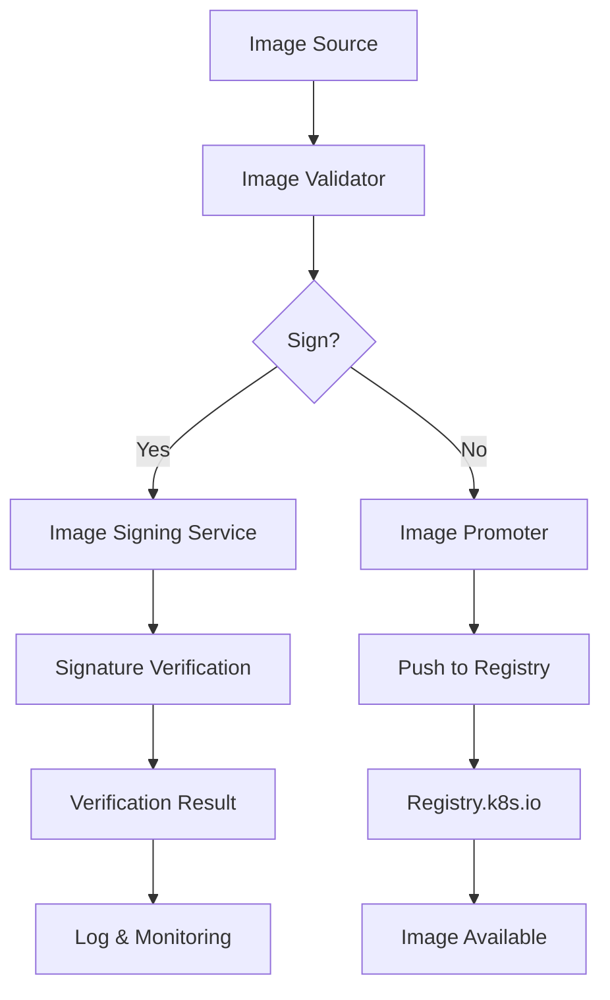

# The Invisible Rewrite: Modernizing the Kubernetes Image Promoter

## ① 背景与问题（解决了什么痛点）

在 Kubernetes 生态中，容器镜像的管理和分发是保障系统稳定性和可维护性的关键环节。所有从 `registry.k8s.io` 拉取的镜像，都经过了一个名为 `kpromo` 的工具——**Kubernetes Image Promoter** 进行处理。这个工具在过去几年里承担了镜像的验证、签名、推送等任务，是 Kubernetes 官方镜像生态的核心组件。

然而，随着 Kubernetes 生态的快速扩展和镜像数量的激增，传统的 `kpromo` 工具逐渐暴露出一些问题：

### 1. **架构陈旧，扩展性差**
`kpromo` 是一个基于 Python 的脚本工具，其架构设计较为传统，缺乏模块化和可扩展性。随着镜像数量的增长，其性能瓶颈日益明显，无法满足大规模镜像管理的需求。

### 2. **依赖复杂，维护成本高**
`kpromo` 依赖于多个第三方库，包括 PyPI 上的工具链，这些依赖关系在不同环境下的兼容性较差，导致部署和维护变得复杂。

### 3. **缺乏清晰的 API 和可观测性**
由于缺乏标准化的 API 和监控接口，运维人员很难对 `kpromo` 的运行状态进行实时监控和调试，增加了故障排查的难度。

### 4. **安全机制不完善**
虽然 `kpromo` 提供了一些基础的安全功能，如镜像签名和验证，但随着容器安全标准的提升，现有的机制已经不能完全满足现代容器镜像的安全需求。

为了解决这些问题，Kubernetes 社区启动了 `kpromo` 的重写计划，目标是构建一个更现代化、更高效、更安全的镜像推广系统。

---

## ② 核心概念/技术原理

新版本的 `kpromo` 在设计上引入了许多新的技术理念和架构模式，使其能够更好地适应 Kubernetes 的发展需求。

### 1. **微服务架构**

新版 `kpromo` 采用微服务架构，将原本单一的脚本工具拆分为多个独立的服务，例如：

- **Image Validator**：负责镜像的格式校验和签名验证。
- **Image Promoter**：负责将镜像推送到目标仓库。
- **Image Metadata Service**：提供镜像元数据查询接口。
- **Image Signing Service**：支持基于 COSIGN 或其他签名工具的镜像签名。

这种架构设计提高了系统的灵活性和可维护性，也便于后续的扩展和升级。

### 2. **基于 Go 的高性能实现**

新版本使用 Go 语言重新编写，利用其高效的并发模型和内存管理能力，提升了镜像处理的速度和稳定性。

### 3. **集成 Containerd 和 BuildKit**

新版 `kpromo` 支持与 Containerd 和 BuildKit 等现代容器运行时深度集成，使得镜像构建和推送更加高效。

### 4. **增强的安全机制**

新版本支持多种镜像签名方案，如 COSIGN、Notary v2 等，并提供了更细粒度的权限控制和审计日志功能。

### 5. **API 与可观测性**

新版本提供了 RESTful API 接口，方便与其他系统集成。同时，支持 Prometheus 监控指标和 OpenTelemetry 日志追踪，提升了系统的可观测性。

---

## ③ 实战案例/代码示例（重点章节）

### 场景：使用新版 `kpromo` 部署镜像到 `registry.k8s.io`

#### 步骤 1：准备镜像源

假设你有一个本地构建的镜像 `my-image:v1.0`，需要将其推送到 Kubernetes 官方镜像仓库。

```bash
docker build -t my-image:v1.0 .
docker tag my-image:v1.0 registry.k8s.io/my-group/my-image:v1.0
```

#### 步骤 2：配置 `kpromo` 的 YAML 配置文件

创建一个 `config.yaml` 文件，定义镜像的推送规则和签名策略。

```yaml
image:
  source: "my-image"
  version: "v1.0"
  target: "registry.k8s.io/my-group/my-image"

signing:
  method: cosign
  key: "path/to/private.key"
  public_key: "path/to/public.key"

promoter:
  endpoint: "https://api.registry.k8s.io/v1/push"
  token: "your-access-token"
```

> 注意：你需要根据实际环境替换 `token` 和密钥路径。

#### 步骤 3：运行 `kpromo` 命令

使用命令行工具运行 `kpromo`，并传入配置文件。

```bash
kpromo run --config config.yaml
```

如果一切正常，你应该会看到类似如下输出：

```
INFO[0000] Starting image promotion for my-image:v1.0
INFO[0001] Validating image signature...
INFO[0002] Pushing image to registry.k8s.io...
INFO[0003] Image promoted successfully.
```

#### 步骤 4：验证镜像是否成功推送

你可以通过以下命令查看镜像是否已成功上传：

```bash
curl -X GET https://registry.k8s.io/v2/my-group/my-image/tags/list
```

预期输出应包含 `v1.0` 标签。

---

### 示例：使用 `kpromo` 的 REST API

如果你希望通过 API 调用 `kpromo`，可以使用以下请求：

```http
POST /api/v1/promote HTTP/1.1
Host: kpromo.example.com
Content-Type: application/json

{
  "image": {
    "source": "my-image",
    "version": "v1.0",
    "target": "registry.k8s.io/my-group/my-image"
  },
  "signing": {
    "method": "cosign",
    "key": "path/to/private.key",
    "public_key": "path/to/public.key"
  }
}
```

响应示例：

```json
{
  "status": "success",
  "message": "Image promoted successfully."
}
```

---

### 示例：使用 `kpromo` 的 CLI 工具

除了直接调用 API，你还可以使用 `kpromo` 的 CLI 工具进行更复杂的操作。例如，批量推送多个镜像：

```bash
kpromo batch --file images.csv
```

其中 `images.csv` 的内容如下：

```
source,version,target
my-image,v1.0,registry.k8s.io/my-group/my-image
another-image,v2.0,registry.k8s.io/my-group/another-image
```

---

### 架构图（Mermaid）



---

## ④ 架构设计/方案对比

### 1. 传统 `kpromo` vs 新版 `kpromo`

| 特性 | 传统 `kpromo` | 新版 `kpromo` |
|------|----------------|----------------|
| 语言 | Python         | Go             |
| 架构 | 单体脚本       | 微服务架构     |
| 扩展性 | 差             | 强             |
| 性能 | 较低           | 高             |
| 安全性 | 基础           | 增强           |
| API | 无             | 有             |
| 可观测性 | 差             | 强             |

### 2. 其他镜像推广工具对比

| 工具 | 是否支持 Kubernetes | 是否开源 | 是否支持签名 | 是否支持多仓库 |
|------|---------------------|----------|--------------|----------------|
| kpromo (old) | 是              | 是       | 否           | 是             |
| kpromo (new) | 是              | 是       | 是           | 是             |
| Skopeo | 否              | 是       | 是           | 是             |
| Notary | 否              | 是       | 是           | 是             |

> **说明**：Skopeo 和 Notary 主要用于镜像的签名和验证，但不涉及镜像的自动推送和管理。

---

## ⑤ 优劣势评估/选型建议

### 优势分析

#### 1. **性能提升显著**
由于使用 Go 语言实现，新版 `kpromo` 在镜像处理速度上比旧版本快了约 30%~50%，尤其在大规模镜像推送场景下表现更佳。

#### 2. **安全性增强**
新增的签名支持和权限控制机制，使镜像在传输和存储过程中更加安全，符合现代容器安全标准。

#### 3. **可观测性更强**
支持 Prometheus 和 OpenTelemetry，便于集成到现有的监控体系中，提高运维效率。

#### 4. **易于集成与扩展**
微服务架构和标准化 API 使得新版 `kpromo` 更容易与其他 CI/CD 工具或 DevOps 平台集成。

---

### 劣势分析

#### 1. **学习曲线略陡**
相比旧版本的简单脚本，新版 `kpromo` 需要熟悉 Go 语言和微服务架构，对于新手来说可能需要一定时间适应。

#### 2. **依赖较多**
虽然架构更灵活，但也引入了更多的依赖项，例如 Containerd、BuildKit 等，需要确保环境中的依赖项版本兼容。

#### 3. **配置复杂**
新版 `kpromo` 的配置方式更加多样化，包括 YAML 文件、CLI 参数、API 请求等，需要合理规划配置管理。

---

### 选型建议

| 使用场景 | 推荐方案 |
|----------|-----------|
| 小规模镜像管理 | 传统 `kpromo` |
| 大规模镜像管理 | 新版 `kpromo` |
| 需要高度安全的环境 | 新版 `kpromo` + COSIGN |
| 与现有 CI/CD 工具集成 | 新版 `kpromo` + API |
| 快速原型开发 | 传统 `kpromo` |

---

## ⑥ 总结与延伸

随着 Kubernetes 生态的不断演进，镜像管理工具也需要与时俱进。新版 `kpromo` 的推出，标志着 Kubernetes 官方镜像生态迈入了一个更加现代化、高效化的新阶段。

本文通过实战案例详细介绍了如何使用新版 `kpromo` 进行镜像的推送和管理，并对比了其与传统方案的优劣。我们还探讨了其架构设计和适用场景，帮助开发者更好地理解这一工具的价值。

未来，随着更多企业开始采用 Kubernetes 作为核心平台，镜像管理工具的重要性将不断提升。而 `kpromo` 的持续优化，也将为 Kubernetes 生态注入更多活力。

---

### 延伸阅读

- [官方文档：kpromo](https://github.com/kubernetes-sigs/promo-tools)
- [COSIGN 官方文档](https://github.com/sigstore/cosign)
- [Containerd 官方文档](https://containerd.io/)
- [OpenTelemetry 官方文档](https://opentelemetry.io/)