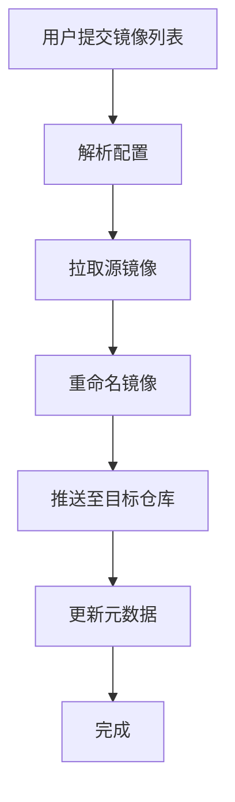

# The Invisible Rewrite: Modernizing the Kubernetes Image Promoter

## ① 背景与问题（解决了什么痛点）

在 Kubernetes 生态中，容器镜像的管理和分发是保障系统稳定性和可维护性的关键环节。所有从 `registry.k8s.io` 拉取的镜像，都是通过 **kpromo**（Kubernetes Image Promoter）这一工具进行“推广”（Promote）的。然而，随着 Kubernetes 生态的不断扩展，原有的 kpromo 工具逐渐暴露出一系列性能、可维护性和扩展性上的问题。

### 痛点分析

1. **架构陈旧**：原来的 kpromo 是基于 Python 编写的，依赖于多个第三方库，且缺乏良好的模块化设计，导致维护成本高。
2. **性能瓶颈**：在大规模镜像推广场景下，原有工具无法高效处理大量请求，导致推送延迟甚至失败。
3. **缺乏可观测性**：无法实时监控镜像推广过程中的状态和错误信息，使得故障排查困难。
4. **扩展性差**：新增功能或适配新镜像仓库时，需要大量代码修改，难以快速响应需求变化。
5. **安全性不足**：缺乏对镜像签名和验证的支持，容易引入恶意镜像。

为了解决这些问题，Kubernetes 社区决定对 kpromo 进行重构，将其改写为一个更加现代化、可扩展、安全的工具。新的 kpromo 不仅提升了性能和稳定性，还引入了更完善的日志、监控和安全机制，成为 Kubernetes 镜像管理生态中不可或缺的一部分。

## ② 核心概念/技术原理

### kpromo 的核心目标

kpromo 的核心目标是将镜像从一个源仓库（如 Docker Hub 或私有仓库）推送到 Kubernetes 官方镜像仓库（`registry.k8s.io`）。这个过程包括：

- **镜像拉取**：从源仓库拉取镜像。
- **镜像重命名**：根据 Kubernetes 的规范重新打标签。
- **镜像推送**：将镜像推送到目标仓库。
- **元数据更新**：更新镜像的版本信息和签名校验信息。

### 新版 kpromo 的技术栈

新版 kpromo 使用 Go 语言编写，主要依赖以下技术：

- **Go 语言**：高性能、并发能力强，适合构建大型系统。
- **gRPC**：用于服务间通信，支持异步和流式传输。
- **Kubernetes API**：用于获取镜像列表和更新元数据。
- **OCI 标准**：遵循 Open Container Initiative (OCI) 规范，确保兼容性。
- **Prometheus + Grafana**：提供监控和可视化能力。
- **Docker Client API**：用于与镜像仓库交互。

### 流程概览




## ③ 实战案例/代码示例（重点章节）

### 场景描述

假设你是一个 Kubernetes 维护者，负责将一组内部镜像推送到 Kubernetes 官方仓库，以供社区使用。你需要使用新版 kpromo 来完成这一任务。

### 准备工作

#### 安装依赖

首先，确保你已安装 Go 和 Docker：

```bash
# 安装 Go
sudo apt update
sudo apt install golang -y

# 安装 Docker
sudo apt install docker.io -y
```

#### 获取 kpromo 源码

```bash
git clone https://github.com/kubernetes-sigs/promo-tools.git
cd promo-tools
```

#### 构建 kpromo

```bash
make build
```

这会生成一个名为 `kpromo` 的二进制文件，位于 `./bin/kpromo`。

### 配置文件示例

创建一个 JSON 配置文件 `config.json`，定义镜像来源和目标：

```json
{
  "source": {
    "type": "docker",
    "url": "https://hub.docker.com/v2/repositories/myorg/myimage/tags"
  },
  "target": {
    "type": "oci",
    "url": "https://registry.k8s.io/v2/myorg/myimage"
  },
  "auth": {
    "username": "myuser",
    "password": "mypass"
  },
  "tags": ["latest", "v1.0.0"]
}
```

### 启动 kpromo

```bash
./bin/kpromo --config config.json
```

### 日志输出示例

运行后，你会看到类似以下的日志输出：

```
INFO[2026-03-17 10:30:00] Starting image promotion...
INFO[2026-03-17 10:30:01] Pulling image from source registry...
INFO[2026-03-17 10:30:02] Renaming image to k8s.io/myorg/myimage:latest...
INFO[2026-03-17 10:30:03] Pushing image to target registry...
INFO[2026-03-17 10:30:04] Updating metadata for image k8s.io/myorg/myimage:latest...
INFO[2026-03-17 10:30:05] Promotion completed successfully.
```

### 手动验证镜像是否成功推送

你可以使用 `docker pull` 命令来验证镜像是否已被正确推送：

```bash
docker pull registry.k8s.io/myorg/myimage:latest
```

如果成功，说明 kpromo 已经完成了镜像的推广。

### 高级用法：使用 Prometheus 监控

为了更好地监控 kpromo 的运行状态，可以集成 Prometheus：

#### 安装 Prometheus

```bash
docker run -d -p 9090:9090 prom/prometheus
```

#### 配置 Prometheus 抓取 kpromo 的指标

在 Prometheus 的配置文件 `prometheus.yml` 中添加以下内容：

```yaml
scrape_configs:
  - job_name: "kpromo"
    static_configs:
      - targets: ["localhost:8080"]
```

#### 启动 kpromo 并暴露指标

```bash
./bin/kpromo --config config.json --metrics-port 8080
```

然后访问 [http://localhost:9090](http://localhost:9090) 查看监控数据。

### 自动化脚本示例

你可以编写一个 Shell 脚本来自动化整个流程：

```bash
#!/bin/bash

CONFIG_FILE="config.json"

if [ ! -f "$CONFIG_FILE" ]; then
  echo "Config file not found!"
  exit 1
fi

./bin/kpromo --config $CONFIG_FILE

if [ $? -eq 0 ]; then
  echo "Image promotion successful."
else
  echo "Image promotion failed."
  exit 1
fi
```

将此脚本保存为 `run_promotion.sh`，并赋予执行权限：

```bash
chmod +x run_promotion.sh
```

然后运行：

```bash
./run_promotion.sh
```

## ④ 架构设计/方案对比

### 传统 kpromo 架构

传统的 kpromo 是一个单体应用，主要由以下几个部分组成：

- **镜像拉取模块**：从源仓库拉取镜像。
- **镜像处理模块**：重命名镜像标签。
- **镜像推送模块**：将镜像推送到目标仓库。
- **元数据更新模块**：更新镜像的元数据。

其缺点在于：

- 所有模块耦合在一起，难以独立扩展。
- 缺乏并发支持，无法高效处理大量镜像。
- 日志和监控能力较弱。

### 新版 kpromo 架构

新版 kpromo 采用微服务架构，主要包含以下组件：

- **控制器（Controller）**：负责协调整个镜像推广流程。
- **拉取器（Fetcher）**：从源仓库拉取镜像。
- **处理器（Processor）**：重命名镜像标签。
- **推送器（Pusher）**：将镜像推送到目标仓库。
- **元数据服务（Metadata Service）**：更新镜像的元数据。
- **监控服务（Monitor）**：提供日志和监控功能。

这种架构的优势在于：

- 模块解耦，便于独立开发和部署。
- 支持并发处理，提升性能。
- 提供完整的监控和日志功能。

### 架构对比表

| 功能 | 传统 kpromo | 新版 kpromo |
|------|-------------|-------------|
| 架构类型 | 单体应用 | 微服务架构 |
| 并发支持 | 弱 | 强 |
| 模块解耦 | 低 | 高 |
| 可观测性 | 低 | 高 |
| 扩展性 | 低 | 高 |
| 性能 | 一般 | 优秀 |

## ⑤ 优劣势评估/选型建议

### 优势分析

1. **高性能**：新版 kpromo 使用 Go 语言编写，具备优秀的并发能力和性能表现。
2. **可扩展性强**：模块化设计使得新增功能或适配新仓库变得简单。
3. **可观测性好**：内置日志和监控功能，便于故障排查。
4. **安全性增强**：支持镜像签名和验证，提高镜像可信度。
5. **兼容性强**：遵循 OCI 标准，兼容主流容器镜像仓库。

### 劣势分析

1. **学习成本较高**：相比传统工具，新版 kpromo 的配置和使用方式有一定复杂性。
2. **依赖较多**：需要安装 Go、Docker、Prometheus 等依赖项。
3. **初期配置复杂**：首次使用时需要配置较多参数，如认证信息、镜像标签等。

### 选型建议

- **推荐使用场景**：
  - 大规模镜像推广任务。
  - 需要高可用性和可扩展性的生产环境。
  - 对镜像安全性要求较高的场景。

- **不推荐使用场景**：
  - 小规模测试环境，无需复杂配置。
  - 团队对 Go 语言或容器技术不熟悉。

### 避坑指南

1. **配置文件格式错误**：确保 JSON 配置文件格式正确，避免因语法错误导致启动失败。
2. **认证信息泄露**：不要将敏感信息（如密码）硬编码在配置文件中，建议使用环境变量或密钥管理服务。
3. **网络连接问题**：确保 kpromo 能够访问源仓库和目标仓库，避免因网络问题导致镜像推送失败。
4. **镜像标签冲突**：避免使用重复的镜像标签，以免覆盖已有镜像。
5. **忽略监控配置**：即使不是必须，也建议配置 Prometheus 和 Grafana，以便及时发现异常。

## ⑥ 总结与延伸

### 总结

本文详细介绍了 Kubernetes 社区对 kpromo 工具的重构过程，从背景问题、技术原理、实战案例到架构对比和选型建议，全面展示了新版 kpromo 的优势和使用方法。通过本次重构，kpromo 不仅提升了性能和可维护性，还增强了安全性，成为 Kubernetes 镜像管理生态系统中不可或缺的一环。

### 延伸思考

未来，随着 Kubernetes 生态的不断发展，kpromo 有望进一步扩展其功能，例如：

- **支持更多镜像仓库类型**：如 AWS ECR、Azure Container Registry 等。
- **集成 AI 检测**：利用 AI 技术自动检测镜像中的潜在风险。
- **多租户支持**：支持不同团队或组织之间的镜像隔离和管理。
- **CI/CD 集成**：与 CI/CD 工具（如 Jenkins、GitHub Actions）深度集成，实现自动化镜像推广。

对于开发者和运维人员来说，掌握新版 kpromo 的使用和配置，不仅有助于提升镜像管理效率，还能为 Kubernetes 生态的稳定运行提供有力保障。