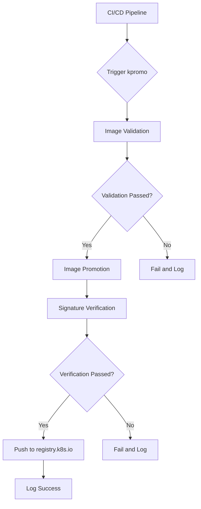

# The Invisible Rewrite: Modernizing the Kubernetes Image Promoter

## ① 背景与问题（解决了什么痛点）

在 Kubernetes 生态中，容器镜像的管理和分发是保障系统稳定性和可维护性的关键环节。所有从 `registry.k8s.io` 拉取的镜像，都是通过 **kpromo**（Kubernetes Image Promoter）这一工具进行“推广”（Promote）的。然而，随着 Kubernetes 生态的不断扩展，原有的 kpromo 工具逐渐暴露出一些性能瓶颈、可维护性差、缺乏灵活性等问题。

### 旧版 kpromo 的痛点

1. **流程复杂，难以维护**：传统的 kpromo 流程涉及多个手动步骤和脚本，容易出错且难以追踪。
2. **缺乏可扩展性**：无法灵活支持新的镜像格式或构建方式，导致新功能开发困难。
3. **缺乏可视化监控**：没有清晰的界面或日志系统来跟踪镜像的生命周期。
4. **安全性不足**：缺少对镜像签名、来源验证等安全机制的支持。
5. **响应速度慢**：面对大规模镜像推送时，处理效率低，影响 CI/CD 流水线的效率。

### 新版 kpromo 的目标

新版 kpromo 的重构旨在解决上述问题，提升镜像管理的自动化程度、可维护性和安全性。它引入了更现代化的架构设计，采用模块化结构，支持多种镜像格式，并提供了更完善的日志和监控能力。

---

## ② 核心概念/技术原理

### 什么是 kpromo？

kpromo 是 Kubernetes 社区用于管理镜像发布流程的工具，负责将构建好的镜像推送到官方镜像仓库（如 `registry.k8s.io`），并确保其符合一定的标准（如标签规范、签名要求等）。

### 重构后的 kpromo 架构

重构后的 kpromo 引入了以下核心组件：

1. **Image Validator**：用于校验镜像的元数据是否符合规范，如标签格式、镜像大小限制等。
2. **Promotion Engine**：负责将镜像从源仓库（如 GCR 或私有仓库）推送到目标仓库（如 registry.k8s.io）。
3. **Signature Verifier**：验证镜像的数字签名，确保镜像来源可信。
4. **Log Aggregator**：集中收集并展示镜像推送过程中的日志信息。
5. **API Server**：提供 REST API 接口，便于与其他 CI/CD 工具集成。

### 工作流程概览



这个流程图展示了新版 kpromo 的整体工作流程，强调了每个阶段的关键节点和决策点。

---

## ③ 实战案例/代码示例（重点章节）

### 场景：在 CI/CD 中集成新版 kpromo

假设你正在使用 GitHub Actions 进行 Kubernetes 镜像的构建和发布。现在你希望将镜像通过新版 kpromo 推送到 `registry.k8s.io`。

#### 1. 安装 kpromo

首先，你需要安装新版 kpromo。你可以通过 Go 或者使用预编译的二进制文件。

```bash
go install github.com/kubernetes-sigs/promo-tools/cmd/kpromo@latest
```

或者下载预编译版本：

```bash
curl -L https://github.com/kubernetes-sigs/promo-tools/releases/download/v1.0.0/kpromo-linux-amd64 -o /usr/local/bin/kpromo
chmod +x /usr/local/bin/kpromo
```

#### 2. 准备配置文件

创建一个 YAML 配置文件 `kpromo.yaml`，定义镜像的来源、目标仓库以及签名规则。

```yaml
image:
  source: gcr.io/my-project/my-image
  target: registry.k8s.io/my-project/my-image
  tag: latest

signature:
  enabled: true
  key: "my-signing-key"
  algorithm: "sha256"

validation:
  tags:
    - "latest"
    - "v1.0.0"
    - "v1.0.1"
  size_limit_mb: 100
```

#### 3. 编写 GitHub Actions 工作流

创建 `.github/workflows/promote-image.yml` 文件，定义工作流：

```yaml
name: Promote Image

on:
  push:
    branches:
      - main

jobs:
  promote:
    runs-on: ubuntu-latest
    steps:
      - name: Checkout code
        uses: actions/checkout@v2

      - name: Set up Go
        uses: actions/setup-go@v2
        with:
          go-version: '1.20'

      - name: Install kpromo
        run: |
          curl -L https://github.com/kubernetes-sigs/promo-tools/releases/download/v1.0.0/kpromo-linux-amd64 -o /usr/local/bin/kpromo
          chmod +x /usr/local/bin/kpromo

      - name: Validate image
        run: kpromo validate --config kpromo.yaml

      - name: Promote image
        run: kpromo promote --config kpromo.yaml
```

#### 4. 执行工作流

提交代码后，GitHub Actions 将自动运行该工作流。如果一切正常，镜像将被验证并通过 kpromo 推送到 `registry.k8s.io`。

#### 5. 查看日志

你可以通过 kpromo 提供的日志接口查看详细的推送过程。例如，访问 `http://localhost:8080/logs`（假设你启动了日志服务）。

```bash
kubectl port-forward svc/kpromo-log-service 8080
```

然后打开浏览器访问 `http://localhost:8080/logs`，查看推送日志。

---

## ④ 架构设计/方案对比

### 旧版 vs 新版 kpromo 架构对比

| 组件 | 旧版 kpromo | 新版 kpromo |
|------|-------------|-------------|
| 验证机制 | 简单的脚本检查 | 模块化验证器（支持多标签、大小限制） |
| 签名验证 | 无 | 支持数字签名验证 |
| 日志系统 | 无 | 集成日志聚合器 |
| 扩展性 | 低 | 高（支持插件式架构） |
| API 支持 | 无 | 提供 REST API 接口 |
| 部署方式 | 单一脚本 | 支持 Docker 容器部署 |

### 架构图（ASCII 版本）

```
+-----------------------+
|     CI/CD Pipeline    |
+-----------------------+
           |
           v
+-----------------------+
|     kpromo (CLI)      |
+-----------------------+
           |
           v
+-----------------------+
| Image Validator       |
+-----------------------+
           |
           v
+-----------------------+
| Promotion Engine      |
+-----------------------+
           |
           v
+-----------------------+
| Signature Verifier    |
+-----------------------+
           |
           v
+-----------------------+
| Log Aggregator        |
+-----------------------+
           |
           v
+-----------------------+
| registry.k8s.io       |
+-----------------------+
```

### 方案选择建议

如果你需要高度定制化的镜像管理流程，推荐使用新版 kpromo；如果你只需要简单的镜像推送功能，旧版 kpromo 仍可满足需求。但考虑到长期维护和扩展性，建议尽快迁移到新版。

---

## ⑤ 优劣势评估/选型建议

### 新版 kpromo 的优势

1. **模块化设计**：易于扩展和维护，支持自定义验证规则。
2. **增强的安全性**：支持镜像签名验证，防止恶意镜像注入。
3. **更好的日志和监控**：提供完整的日志记录和可视化界面。
4. **兼容性强**：支持多种镜像格式和构建平台。
5. **API 支持**：方便与 CI/CD 工具集成。

### 新版 kpromo 的劣势

1. **学习成本较高**：需要熟悉新的配置文件结构和 API 接口。
2. **部署复杂度增加**：相比旧版，需要更多依赖项和配置。
3. **资源消耗较大**：由于引入了日志聚合器等组件，对服务器资源有一定要求。

### 选型建议

| 场景 | 推荐方案 |
|------|----------|
| 小规模项目，简单镜像推送 | 旧版 kpromo |
| 中大型项目，需要安全性和可扩展性 | 新版 kpromo |
| 企业级镜像管理，需与 CI/CD 集成 | 新版 kpromo + 自定义插件 |
| 开发测试环境，快速验证 | 旧版 kpromo 或 kpromo CLI |

---

## ⑥ 总结与延伸

新版 kpromo 的重构是 Kubernetes 生态中一次重要的技术升级，它不仅提升了镜像管理的自动化水平，还增强了系统的安全性与可维护性。对于开发者和运维人员来说，掌握新版 kpromo 的使用方法是必不可少的技能。

### 延伸阅读建议

- [Kubernetes 官方文档 - Image Management](https://kubernetes.io/docs/concepts/containers/images/)
- [kpromo GitHub 项目页面](https://github.com/kubernetes-sigs/promo-tools)
- [Container Image Signing with Notary](https://docs.docker.com/trust/)

### 未来展望

随着云原生技术的不断发展，kpromo 可能会进一步集成 AI 驱动的镜像分析功能，实现智能镜像推荐、异常检测等功能。这将为 Kubernetes 用户带来更加智能化的镜像管理体验。

---

> 📝 本文基于 Kubernetes 官方博客《The Invisible Rewrite: Modernizing the Kubernetes Image Promoter》整理撰写，结合实战场景与代码示例，帮助读者更好地理解和应用新版 kpromo。