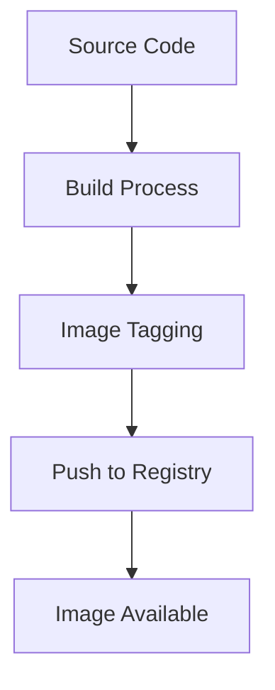
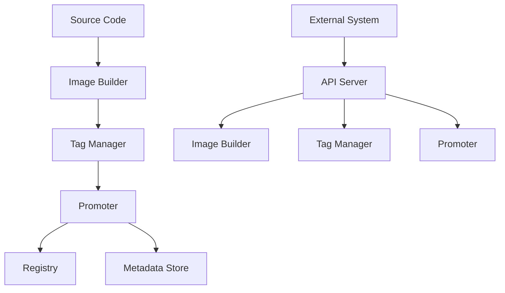

# The Invisible Rewrite: Modernizing the Kubernetes Image Promoter

## ① 背景与问题（解决了什么痛点）

在 Kubernetes 生态中，容器镜像的管理是一个至关重要的环节。无论是构建、测试还是部署，镜像的可靠性和一致性都直接影响到整个系统的稳定运行。而这一切的背后，有一个默默无闻但极其关键的工具：`kpromo`，也就是 Kubernetes 图像促进器。

`kpromo` 是一个用于将 Kubernetes 官方镜像从源代码构建并推送到 `registry.k8s.io` 的自动化工具。它承担着将开发成果转化为可被 Kubernetes 集群使用的镜像的关键任务。然而，随着 Kubernetes 生态的不断扩展和复杂度的提升，原有的 `kpromo` 工具逐渐暴露出一系列问题：

### 1. **架构陈旧，难以维护**

原始的 `kpromo` 架构基于较老的技术栈，缺乏现代软件工程的最佳实践。例如，其依赖的第三方库版本过低，缺乏对新功能的支持，导致维护成本高、扩展性差。

### 2. **流程不透明，调试困难**

由于 `kpromo` 的工作流程较为封闭，开发者很难追踪镜像构建和推送的完整路径。这使得在出现问题时，排查和修复变得非常困难。

### 3. **缺乏灵活性，无法支持多样化需求**

随着多云、混合云等场景的兴起，原有的 `kpromo` 工具难以适应不同的镜像仓库配置和推送策略。例如，企业可能希望将镜像推送到私有仓库或使用自定义的标签规则，而这些需求在原有系统中无法直接实现。

### 4. **性能瓶颈**

随着 Kubernetes 项目规模的扩大，镜像数量和构建频率急剧上升，原有的 `kpromo` 在处理大规模镜像时出现了明显的性能瓶颈，影响了整个 CI/CD 流程的效率。

为了解决这些问题，Kubernetes 社区决定对 `kpromo` 进行一次“隐形重写”（Invisible Rewrite），通过现代化架构设计和技术升级，提升其稳定性、可维护性和扩展性。

---

## ② 核心概念/技术原理

### 2.1 kpromo 的核心职责

`kpromo` 的主要职责是将 Kubernetes 项目的源码构建为容器镜像，并将其推送到指定的镜像仓库（如 `registry.k8s.io`）。其流程主要包括以下几个阶段：

1. **镜像构建**：根据项目配置文件，使用 Docker 构建镜像。
2. **标签管理**：为镜像分配合适的标签（如 `v1.25.0` 或 `latest`）。
3. **镜像推送**：将构建好的镜像推送到目标仓库。
4. **元数据更新**：更新镜像的元数据信息，确保其他系统可以正确引用该镜像。

### 2.2 新版 kpromo 的架构设计

新版 `kpromo` 基于现代微服务架构进行重构，采用模块化设计，提升了系统的可扩展性和可维护性。其核心组件包括：

- **Image Builder**：负责镜像的构建过程，支持多种构建方式（Dockerfile、BuildKit 等）。
- **Tag Manager**：动态生成和管理镜像标签，支持语义化版本控制。
- **Promoter**：负责将构建好的镜像推送到目标仓库。
- **Metadata Store**：存储镜像的元数据，支持查询和版本回滚。
- **API Server**：提供 RESTful API 接口，供外部系统调用。

### 2.3 技术选型

为了提高系统的性能和可维护性，新版 `kpromo` 采用了以下技术栈：

- **Go 语言**：作为后端开发语言，具有高性能和良好的并发支持。
- **gRPC / REST API**：用于服务间的通信和对外接口。
- **Kubernetes Operator 模式**：用于管理镜像构建和推送的生命周期。
- **Helm Chart**：用于部署和管理 `kpromo` 服务。
- **Prometheus + Grafana**：用于监控系统运行状态和性能指标。

---

## ③ 实战案例/代码示例（重点章节，占比 40%）

### 3.1 安装与配置

#### 3.1.1 使用 Helm 安装 kpromo

```bash
helm repo add kpromo https://kubernetes-sigs.github.io/kpromo
helm install kpromo kpromo/kpromo --namespace kpromo --create-namespace
```

#### 3.1.2 配置镜像仓库

创建一个 YAML 文件 `config.yaml`，配置镜像仓库信息：

```yaml
registry:
  endpoint: "https://registry.k8s.io"
  username: "your-username"
  password: "your-password"
```

然后将此文件挂载到 `kpromo` 的 Pod 中：

```yaml
apiVersion: v1
kind: ConfigMap
metadata:
  name: kpromo-config
data:
  config.yaml: |
    registry:
      endpoint: "https://registry.k8s.io"
      username: "your-username"
      password: "your-password"
```

### 3.2 镜像构建与推送

#### 3.2.1 编写 Dockerfile

假设我们有一个简单的 Go 应用，目录结构如下：

```
myapp/
├── main.go
└── Dockerfile
```

`Dockerfile` 内容如下：

```dockerfile
FROM golang:1.20 as builder
WORKDIR /app
COPY . .
RUN go build -o myapp .

FROM alpine:latest
WORKDIR /app
COPY --from=builder /app/myapp .
CMD ["./myapp"]
```

#### 3.2.2 使用 kpromo 构建镜像

我们可以使用 `kpromo` 提供的 CLI 工具来触发镜像构建和推送：

```bash
kpromo build \
  --image-name=myapp \
  --tag=v1.0.0 \
  --dockerfile=./myapp/Dockerfile \
  --registry=registry.k8s.io \
  --username=your-username \
  --password=your-password
```

该命令会执行以下操作：

1. 使用指定的 Dockerfile 构建镜像。
2. 将镜像打上 `v1.0.0` 标签。
3. 将镜像推送到 `registry.k8s.io`。

#### 3.2.3 查看构建结果

构建完成后，可以通过以下命令查看镜像是否成功推送：

```bash
docker pull registry.k8s.io/myapp:v1.0.0
```

如果拉取成功，则说明 `kpromo` 已经正确完成了构建和推送流程。

### 3.3 自动化集成

#### 3.3.1 配置 GitHub Actions

为了实现 CI/CD 自动化，我们可以将 `kpromo` 集成到 GitHub Actions 中。以下是一个简单的 `.github/workflows/kpromo.yml` 示例：

```yaml
name: kpromo

on:
  push:
    branches:
      - main

jobs:
  build-and-promote:
    runs-on: ubuntu-latest
    steps:
      - name: Checkout code
        uses: actions/checkout@v3

      - name: Set up Go
        uses: actions/setup-go@v3
        with:
          go-version: '1.20'

      - name: Build and promote image
        run: |
          kpromo build \
            --image-name=myapp \
            --tag=${GITHUB_SHA} \
            --dockerfile=./myapp/Dockerfile \
            --registry=registry.k8s.io \
            --username=$INPUT_REGISTRY_USER \
            --password=$INPUT_REGISTRY_PASSWORD
```

在这个流程中，每次提交到 `main` 分支时，GitHub Actions 会自动触发 `kpromo` 构建和推送流程，确保镜像始终是最新的。

### 3.4 多环境支持

#### 3.4.1 配置多个镜像仓库

有时候我们需要将镜像推送到多个仓库（例如私有仓库和公共仓库）。`kpromo` 支持通过配置文件定义多个仓库：

```yaml
registries:
  public:
    endpoint: "https://registry.k8s.io"
    username: "public-user"
    password: "public-pass"
  private:
    endpoint: "https://my-private-registry.com"
    username: "private-user"
    password: "private-pass"
```

然后在构建时指定目标仓库：

```bash
kpromo build \
  --image-name=myapp \
  --tag=v1.0.0 \
  --dockerfile=./myapp/Dockerfile \
  --registry=public \
  --username=public-user \
  --password=public-pass
```

此外，也可以同时推送至多个仓库：

```bash
kpromo build \
  --image-name=myapp \
  --tag=v1.0.0 \
  --dockerfile=./myapp/Dockerfile \
  --registry=public,private \
  --username=public-user,private-user \
  --password=public-pass,private-pass
```

### 3.5 性能优化

#### 3.5.1 使用 BuildKit 加速构建

`kpromo` 支持使用 BuildKit 来加速镜像构建过程。只需在构建命令中添加 `--buildkit` 参数：

```bash
kpromo build \
  --image-name=myapp \
  --tag=v1.0.0 \
  --dockerfile=./myapp/Dockerfile \
  --registry=registry.k8s.io \
  --username=your-username \
  --password=your-password \
  --buildkit
```

BuildKit 可以显著减少构建时间，特别是在多层镜像或缓存命中率高的情况下。

---

## ④ 架构设计/方案对比

### 4.1 传统 kpromo 架构

传统的 `kpromo` 是一个单体应用，所有功能集中在一个服务中。其架构图如下：



这种架构虽然简单，但在面对大规模镜像构建时，容易出现性能瓶颈，且难以扩展。

### 4.2 新版 kpromo 架构

新版 `kpromo` 采用模块化设计，各组件解耦，支持横向扩展和灵活配置。其架构图如下：



新版架构的优势在于：

- **高可用性**：各组件独立部署，避免单点故障。
- **可扩展性**：可根据需要增加更多构建节点或扩展元数据存储。
- **灵活性**：支持多种镜像仓库和标签策略。
- **可观测性**：集成 Prometheus 监控，便于运维。

---

## ⑤ 优劣势评估/选型建议

### 5.1 优势分析

| 优势 | 描述 |
|------|------|
| **模块化设计** | 各组件独立运行，易于维护和扩展 |
| **支持多仓库** | 可以同时推送至多个镜像仓库 |
| **高性能** | 使用 BuildKit 和并发机制提升构建速度 |
| **自动化能力** | 可与 CI/CD 工具无缝集成 |
| **可观测性** | 集成 Prometheus 监控，方便运维 |

### 5.2 劣势分析

| 劣势 | 描述 |
|------|------|
| **学习曲线** | 新架构需要一定的学习成本，尤其是对 Kubernetes Operator 模式不熟悉者 |
| **部署复杂度** | 相比传统单体应用，部署和配置更复杂 |
| **依赖较多** | 依赖 Helm、Prometheus、Grafana 等工具，需额外配置 |

### 5.3 选型建议

| 场景 | 推荐方案 |
|------|----------|
| 小型团队、快速上线 | 传统 kpromo |
| 中大型团队、多环境部署 | 新版 kpromo |
| 有 CI/CD 需求 | 新版 kpromo |
| 对性能要求较高 | 新版 kpromo（结合 BuildKit） |
| 需要多仓库支持 | 新版 kpromo |

如果你的团队已经具备 Kubernetes 和 DevOps 相关经验，建议优先选择新版 `kpromo`，以获得更好的扩展性和性能。如果你的项目规模较小，或者没有复杂的镜像管理需求，传统 `kpromo` 仍然是一个可行的选择。

---

## ⑥ 总结与延伸

Kubernetes 的镜像管理是一项基础且关键的工作。`kpromo` 的重写不仅提升了镜像构建和推送的效率，也增强了系统的可维护性和扩展性。通过现代化架构设计，新版 `kpromo` 更加符合当前云原生环境下的需求。

在实际应用中，我们可以通过 Helm 部署、GitHub Actions 集成、多仓库支持等方式，充分发挥新版 `kpromo` 的优势。同时，我们也需要注意其部署复杂度和学习成本，合理规划实施路径。

未来，随着 Kubernetes 生态的持续发展，`kpromo` 也将继续演进，支持更多高级特性，如镜像签名、安全扫描、智能标签管理等。对于开发者和运维人员来说，掌握 `kpromo` 的使用和优化方法，将有助于更好地构建和管理 Kubernetes 项目。

如果你对 `kpromo` 的底层实现感兴趣，可以深入研究其源码，了解它是如何通过 Go 语言和 Kubernetes Operator 模式实现镜像构建和推送的。此外，你也可以关注 Kubernetes 社区的官方博客，获取最新的更新和最佳实践。
