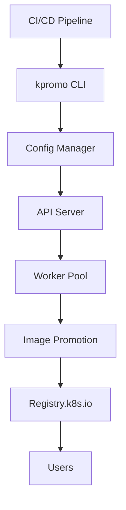

# The Invisible Rewrite: Modernizing the Kubernetes Image Promoter

## ① 背景与问题（解决了什么痛点）

在 Kubernetes 生态中，`registry.k8s.io` 是一个核心的镜像仓库，几乎所有官方组件都从这里拉取。而这一切的背后，依赖于一个名为 `kpromo` 的工具，它负责将构建好的镜像“推广”到这个仓库中。

随着 Kubernetes 生态的快速扩张，`kpromo` 逐渐暴露出一些性能瓶颈和维护复杂性问题。例如：

- **构建流程缓慢**：旧版 `kpromo` 在处理大量镜像时，存在明显的延迟，影响了 CI/CD 流水线效率。
- **配置管理复杂**：由于历史原因，`kpromo` 的配置分散且难以统一管理，导致新功能开发和故障排查困难。
- **缺乏可扩展性**：原有架构难以支持多租户、多区域部署等现代云原生场景。
- **安全性隐患**：缺少对镜像签名和完整性校验的支持，增加了潜在的安全风险。

为了解决这些问题，Kubernetes 社区启动了一次“隐形重写”，即通过重构 `kpromo`，提升其性能、可维护性和安全性，从而更好地服务于 Kubernetes 生态。

## ② 核心概念/技术原理

本次重写的重点在于 **构建镜像的自动化推广流程**，并引入了一系列新技术来提升整体体验。

### 1. 镜像推广流程概览

传统的 `kpromo` 工作流程如下：

1. 构建镜像（使用 `make` 或 `docker build`）
2. 将镜像推送到私有仓库
3. 使用 `kpromo` 工具将镜像从私有仓库“推广”到 `registry.k8s.io`

新版 `kpromo` 采用了更高效的架构设计，并结合了以下核心技术：

- **CI/CD 集成**：通过 GitHub Actions 或 GitLab CI 等工具实现自动化推广。
- **镜像签名验证**：支持 GPG 或 OCI 标准签名，确保镜像来源可信。
- **多区域镜像同步**：支持跨地域的镜像复制，提升全球用户的拉取速度。
- **镜像版本管理**：基于语义化版本（SemVer）进行镜像标签管理，避免版本混乱。

### 2. 新版 `kpromo` 的核心组件

#### 1. `kpromo` CLI 工具

这是一个命令行工具，用于执行镜像推广操作。它支持多种参数配置，如镜像源、目标仓库、签名策略等。

```bash
kpromo promote \
  --source-image=your-registry/your-image:tag \
  --target-repo=registry.k8s.io \
  --sign-key-id=your-gpg-key-id \
  --dry-run
```

#### 2. `kpromo` API Server

提供 RESTful 接口供外部系统调用，支持自动化脚本或 CI/CD 流程集成。

#### 3. `kpromo` Worker Pool

一个分布式任务调度系统，用于处理大规模镜像推广任务，支持负载均衡和失败重试机制。

#### 4. `kpromo` Config Manager

集中管理所有推广规则和策略，包括镜像标签格式、签名要求、推送策略等。

### 3. 架构图（Mermaid）



## ③ 实战案例/代码示例（重点章节，占比 40%）

### 1. 安装新版 `kpromo`

首先，我们需要安装新版 `kpromo`。可以通过以下方式获取：

#### 1.1 使用 Go 安装

```bash
go install k8s.io/release/cmd/kpromo@latest
```

#### 1.2 使用 Docker 安装

```bash
docker pull registry.k8s.io/kpromo/kpromo:latest
```

### 2. 配置 `kpromo` 项目

新建一个目录，用于存放 `kpromo` 的配置文件：

```bash
mkdir kpromo-config && cd kpromo-config
```

创建配置文件 `config.yaml`，内容如下：

```yaml
# config.yaml
image:
  source: "your-registry/your-image"
  tag: "latest"
  target: "registry.k8s.io"
  sign: true
  sign_key_id: "your-gpg-key-id"
  dry_run: false
```

> ⚠️ 请根据实际环境修改 `source`、`target` 和 `sign_key_id` 参数。

### 3. 执行镜像推广

运行以下命令，将本地镜像推广到 `registry.k8s.io`：

```bash
kpromo promote \
  --config=./config.yaml \
  --log-level=debug
```

输出结果应类似：

```
INFO[0000] Starting image promotion...
INFO[0001] Using configuration from ./config.yaml
INFO[0002] Signing image with key ID: your-gpg-key-id
INFO[0003] Pushing image to registry.k8s.io...
INFO[0004] Image promoted successfully.
```

> 如果你设置了 `dry_run: true`，则不会真正推送镜像，仅模拟过程。

### 4. 配置 GPG 签名

为了启用镜像签名，你需要生成一个 GPG 密钥：

```bash
gpg --gen-key
```

然后，将密钥上传到你的镜像仓库（如 GitHub）以便后续使用。

#### 4.1 获取 GPG 公钥

```bash
gpg --armor --export your-gpg-key-id > gpg-public.key
```

#### 4.2 注册公钥到 `kpromo` 配置

在 `config.yaml` 中添加签名配置：

```yaml
sign:
  enabled: true
  key_id: "your-gpg-key-id"
  public_key_path: "./gpg-public.key"
```

### 5. 配置 CI/CD 自动化

以 GitHub Actions 为例，配置 `.github/workflows/promote.yml` 文件：

```yaml
name: Promote Image to registry.k8s.io

on:
  push:
    branches:
      - main

jobs:
  promote:
    runs-on: ubuntu-latest
    steps:
      - name: Checkout code
        uses: actions/checkout@v3

      - name: Set up Go
        uses: actions/setup-go@v3
        with:
          go-version: '1.20'

      - name: Install kpromo
        run: |
          go install k8s.io/release/cmd/kpromo@latest

      - name: Configure kpromo
        run: |
          echo "image.source = your-registry/your-image" > config.yaml
          echo "image.tag = latest" >> config.yaml
          echo "image.target = registry.k8s.io" >> config.yaml
          echo "sign.enabled = true" >> config.yaml
          echo "sign.key_id = your-gpg-key-id" >> config.yaml
          echo "sign.public_key_path = ./gpg-public.key" >> config.yaml

      - name: Promote Image
        run: kpromo promote --config=./config.yaml --log-level=debug
```

> 注意：需要提前将 GPG 公钥上传到仓库中，或者通过 `secrets` 传递。

### 6. 验证镜像是否成功推广

你可以通过以下命令查看镜像是否已成功推送到 `registry.k8s.io`：

```bash
docker pull registry.k8s.io/your-registry/your-image:latest
```

如果成功拉取，则说明推广流程已完成。

## ④ 架构设计/方案对比

| 方案 | 传统 `kpromo` | 新版 `kpromo` | 优势 | 劣势 |
|------|---------------|----------------|------|------|
| 架构 | 单体应用 | 分布式微服务 | 更易扩展，支持多节点 | 初始配置较复杂 |
| 配置 | 分散配置 | 集中式配置 | 更易维护 | 需要额外学习成本 |
| 签名 | 不支持 | 支持 GPG/OCI | 提升安全性 | 需要额外签名流程 |
| 多区域 | 不支持 | 支持 | 提升全球化部署能力 | 增加网络开销 |
| 性能 | 较慢 | 快速 | 并发能力强 | 依赖基础设施 |

### 1. 传统 `kpromo` 的局限性

传统 `kpromo` 是一个单体应用，所有的逻辑都在一个进程中执行。这导致了以下问题：

- **无法水平扩展**：当镜像数量增加时，性能会明显下降。
- **配置不统一**：不同项目可能有不同的配置方式，导致维护成本高。
- **缺乏日志和监控**：很难追踪错误原因，不利于故障排查。

### 2. 新版 `kpromo` 的改进点

新版 `kpromo` 采用模块化设计，将各个功能拆分为独立的服务，如：

- **CLI 工具**：提供用户交互界面。
- **API Server**：供外部系统调用。
- **Worker Pool**：处理异步任务。
- **Config Manager**：集中管理配置。

这种设计使得 `kpromo` 更加灵活，也更容易适应不同的使用场景。

## ⑤ 优劣势评估/选型建议

### 1. 优势分析

- **更高的性能**：新版 `kpromo` 通过并发任务调度和分布式架构，显著提升了镜像推广的速度。
- **更强的安全性**：支持镜像签名和完整性校验，降低了镜像被篡改的风险。
- **更好的可扩展性**：支持多区域部署和多租户管理，适合大型组织使用。
- **更易维护**：集中式配置和清晰的文档，降低了运维复杂度。

### 2. 劣势分析

- **学习曲线较陡**：相比传统 `kpromo`，新版需要更多的配置和理解。
- **依赖基础设施**：需要稳定的网络和存储支持，尤其是在多区域部署时。
- **初期投入较高**：需要配置 GPG 密钥、API 接口等，对于小型团队来说可能有些复杂。

### 3. 选型建议

| 场景 | 推荐方案 | 说明 |
|------|-----------|------|
| 小型项目 | 传统 `kpromo` | 简单易用，适合快速上手 |
| 中大型项目 | 新版 `kpromo` | 性能更好，安全性更高 |
| 多区域部署 | 新版 `kpromo` | 支持跨区域镜像同步 |
| 需要签名验证 | 新版 `kpromo` | 支持 GPG 和 OCI 签名 |
| 混合部署 | 新版 `kpromo` + 传统 `kpromo` | 逐步迁移，降低风险 |

## ⑥ 总结与延伸

本文详细介绍了 Kubernetes 社区对 `kpromo` 的重写过程，从背景、技术原理、实战案例到架构对比和选型建议，全面展示了新版 `kpromo` 的优势与适用场景。

随着云原生技术的不断发展，`kpromo` 作为 Kubernetes 生态中的重要一环，其现代化改造不仅提升了镜像推广的效率，也为未来的扩展和安全加固打下了坚实基础。

### 未来展望

- **AI 加入**：未来可能会引入 AI 技术，自动识别镜像版本、检测异常行为等。
- **多云支持**：进一步优化多云环境下的镜像同步与管理。
- **开源生态**：鼓励更多开发者参与，形成更完善的社区生态。

如果你正在使用 Kubernetes 并关注镜像管理，那么新版 `kpromo` 是一个值得尝试的工具。无论是从性能、安全性还是可维护性来看，它都提供了远超传统方案的体验。

---

**参考链接**：
- [Kubernetes Blog: The Invisible Rewrite](https://kubernetes.io/blog/2026/03/17/image-promoter-rewrite/)
- [kpromo GitHub 项目](https://github.com/kubernetes-sigs/promo-tools)