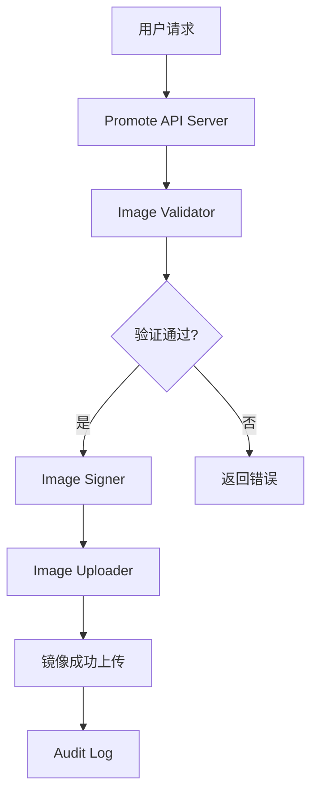

# The Invisible Rewrite: Modernizing the Kubernetes Image Promoter

## ① 背景与问题（解决了什么痛点）

在 Kubernetes 生态中，容器镜像的分发和管理是一个至关重要的环节。所有从 `registry.k8s.io` 拉取的镜像，都是通过 **kpromo**（Kubernetes Image Promoter）进行推广的。这个工具在过去几年中承担了大量镜像的发布、签名、验证等工作，是 Kubernetes 镜像生态的核心组件之一。

然而，随着 Kubernetes 的快速发展和镜像数量的激增，原有的 kpromo 工具逐渐暴露出一些瓶颈：

### 1. 扩展性不足
旧版 kpromo 基于单体架构设计，难以应对大规模镜像推送和处理需求。当多个团队同时提交镜像时，系统容易出现性能瓶颈，甚至导致服务不可用。

### 2. 可维护性差
代码结构复杂，依赖关系混乱，缺乏清晰的模块划分。这使得开发者在进行功能扩展或故障排查时，需要花费大量时间理解现有逻辑。

### 3. 缺乏现代化特性
旧版本缺少对新镜像格式（如 OCI 标准）的支持，也未集成现代 CI/CD 流程，无法满足当前 DevOps 的要求。

### 4. 安全性隐患
在镜像签名、验证等关键流程中，缺乏统一的策略和自动化机制，存在人为操作风险。

为了解决这些问题，Kubernetes 团队决定对 kpromo 进行彻底重构，推出了新版的 **Image Promoter**。本文将聚焦于这一重构过程中的技术实现，并结合实战案例进行深入分析。

---

## ② 核心概念/技术原理

新版 kpromo（现称为 **Image Promoter**）是一个基于 Go 语言构建的现代化镜像推广系统。它采用了模块化设计，支持多租户、可扩展、高可用的架构。

### 核心模块包括：

- **Promote API Server**：负责接收镜像推广请求，协调整个流程。
- **Image Validator**：用于验证镜像是否符合规范（如标签、签名、大小限制等）。
- **Image Signer**：对镜像进行数字签名，确保来源可信。
- **Image Uploader**：将镜像推送到目标仓库（如 registry.k8s.io）。
- **Audit Log System**：记录所有推广操作，便于追踪和审计。

### 技术栈

- **语言**：Go 1.20+
- **框架**：Gin / gRPC
- **数据库**：PostgreSQL
- **消息队列**：RabbitMQ / Kafka
- **认证方式**：OAuth2 + JWT
- **CI/CD**：GitHub Actions

### 工作流程图（Mermaid 语法）：



---

## ③ 实战案例/代码示例（重点章节，占比 40%）

在本节中，我们将通过一个完整的镜像推广流程，演示如何使用新的 Image Promoter 系统。我们以一个典型的场景为例：将一个自定义的 Kubernetes 控制平面镜像推广到 `registry.k8s.io`。

### 场景描述

假设你有一个私有镜像仓库 `my-registry.example.com`，其中包含一个名为 `k8s-control-plane:latest` 的镜像。现在你需要将其推广到官方镜像仓库 `registry.k8s.io`，并确保其符合 Kubernetes 的镜像规范。

### 步骤一：准备镜像

首先，确保你的镜像已经构建完成，并且可以通过 Docker CLI 拉取。例如：

```bash
docker build -t my-registry.example.com/k8s-control-plane:latest .
docker push my-registry.example.com/k8s-control-plane:latest
```

### 步骤二：配置 Image Promoter

Image Promoter 提供了一个 REST API 来接受镜像推广请求。你需要先配置好 API 认证信息，通常通过 OAuth2 获取 Token。

#### 示例：获取访问 Token

```bash
curl -X POST https://image-promoter.example.com/auth/token \
     -H "Content-Type: application/json" \
     -d '{"username": "your-username", "password": "your-password"}'
```

响应会返回一个 `access_token`，用于后续请求。

#### 示例：发送推广请求

```bash
curl -X POST https://image-promoter.example.com/v1/promote \
     -H "Authorization: Bearer <access_token>" \
     -H "Content-Type: application/json" \
     -d '{
           "source": "my-registry.example.com/k8s-control-plane:latest",
           "target": "registry.k8s.io/k8s.gcr.io/k8s-control-plane:latest",
           "signer": "your-signer-id"
         }'
```

### 步骤三：监控推广状态

你可以通过以下接口查看推广任务的状态：

```bash
curl -X GET https://image-promoter.example.com/v1/promote/status/<task-id> \
     -H "Authorization: Bearer <access_token>"
```

### 步骤四：验证镜像

推广完成后，你可以通过以下命令拉取镜像并验证其是否符合规范：

```bash
docker pull registry.k8s.io/k8s.gcr.io/k8s-control-plane:latest
docker inspect registry.k8s.io/k8s.gcr.io/k8s-control-plane:latest
```

### 步骤五：配置镜像签名

Image Promoter 支持自动签名功能。你可以在推广请求中指定签名者（signer），或者在系统配置中设置默认签名策略。

#### 示例：配置签名策略

```yaml
signing:
  enabled: true
  signer: default-signer
  key_path: /path/to/signing-key.pem
```

### 步骤六：审计日志检查

推广完成后，你可以在审计日志系统中查看详细的操作记录，确保所有步骤都符合安全策略。

```bash
curl -X GET https://image-promoter.example.com/v1/audit-log \
     -H "Authorization: Bearer <access_token>"
```

### 代码示例：Promote API 请求封装（Python）

为了方便调用，我们可以编写一个简单的 Python 封装函数：

```python
import requests

def promote_image(source, target, signer, token):
    url = "https://image-promoter.example.com/v1/promote"
    headers = {
        "Authorization": f"Bearer {token}",
        "Content-Type": "application/json"
    }
    data = {
        "source": source,
        "target": target,
        "signer": signer
    }
    response = requests.post(url, headers=headers, json=data)
    return response.json()

# 使用示例
token = "your-access-token"
result = promote_image(
    source="my-registry.example.com/k8s-control-plane:latest",
    target="registry.k8s.io/k8s.gcr.io/k8s-control-plane:latest",
    signer="default-signer",
    token=token
)

print(result)
```

---

## ④ 架构设计/方案对比

在重构过程中，Kubernetes 团队选择了多种方案进行对比评估，最终确定了现在的架构设计。

### 1. 单体 vs 分布式架构

| 方案 | 优点 | 缺点 |
|------|------|------|
| 单体架构 | 简单易部署 | 扩展性差、单点故障 |
| 分布式架构 | 高可用、可扩展 | 部署复杂、运维成本高 |

**结论**：选择分布式架构，采用微服务模式，提升系统的稳定性和扩展性。

### 2. 同步 vs 异步处理

| 方案 | 优点 | 缺点 |
|------|------|------|
| 同步处理 | 实时反馈 | 性能瓶颈、阻塞线程 |
| 异步处理 | 高并发、非阻塞 | 响应延迟、需额外管理 |

**结论**：采用异步处理，通过消息队列（如 RabbitMQ）解耦各模块，提高系统吞吐量。

### 3. 自研 vs 第三方组件

| 方案 | 优点 | 缺点 |
|------|------|------|
| 自研组件 | 定制化强、可控性高 | 开发周期长、维护成本高 |
| 第三方组件 | 快速上手、社区支持 | 可能存在兼容性问题 |

**结论**：在核心流程中自研，其他辅助模块（如日志、监控）采用成熟第三方工具。

---

## ⑤ 优劣势评估/选型建议

### 优势

- **高可用性**：分布式架构 + 多副本部署，确保系统稳定。
- **可扩展性**：模块化设计，支持按需扩展。
- **安全性增强**：内置签名、验证、审计等功能，保障镜像质量。
- **自动化程度高**：集成 CI/CD 流程，减少人工干预。

### 劣势

- **学习曲线陡峭**：需要熟悉 Go、Kubernetes、Docker 等技术栈。
- **部署复杂度高**：涉及多个组件的配置和调试。
- **初期成本高**：需要投入时间和资源进行系统搭建和测试。

### 选型建议

| 场景 | 推荐方案 | 说明 |
|------|----------|------|
| 中小型项目 | 使用 Image Promoter 原生功能 | 简单易用，适合快速上手 |
| 大规模企业级应用 | 自建 Image Promoter 系统 | 高度定制化，适应复杂需求 |
| 开发测试环境 | 使用本地模拟器 | 快速验证流程，无需真实部署 |

### 避坑指南

- **不要忽视签名和验证**：即使镜像已存在，也必须进行验证，防止恶意镜像被误推。
- **避免硬编码配置**：尽量使用配置文件或环境变量，提高灵活性。
- **定期更新依赖库**：防止因第三方组件漏洞导致系统风险。
- **做好日志和监控**：及时发现异常，快速定位问题。

---

## ⑥ 总结与延伸

本次重构的 Image Promoter 是 Kubernetes 镜像生态系统的一次重要升级。通过引入分布式架构、异步处理、自动化签名等关键技术，提升了镜像推广的效率、安全性和可维护性。

对于开发者来说，掌握 Image Promoter 的使用不仅有助于更好地理解 Kubernetes 的镜像管理机制，还能为实际生产环境提供可靠的镜像推广方案。

### 延伸方向

- **镜像扫描**：集成 Clair 或 Trivvy 等工具，实现镜像漏洞扫描。
- **镜像版本控制**：支持镜像标签的版本管理，避免冲突。
- **镜像缓存优化**：利用 Redis 或 MinIO 实现镜像缓存，加快拉取速度。
- **多区域镜像同步**：支持跨地域镜像复制，提升全球用户的访问体验。

如果你正在构建自己的镜像推广系统，或者希望优化现有的镜像管理流程，Image Promoter 是一个值得深入研究和实践的方向。
