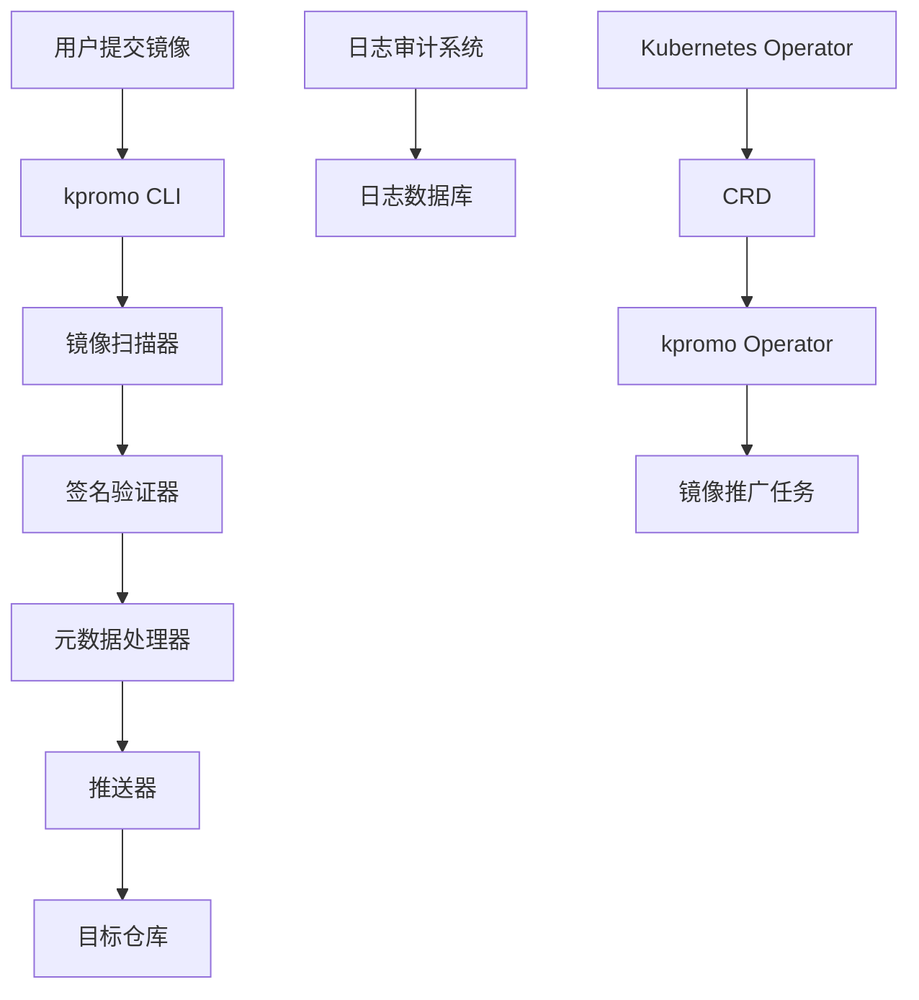

# The Invisible Rewrite: Modernizing the Kubernetes Image Promoter

## ① 背景与问题（解决了什么痛点）

在 Kubernetes 生态中，`registry.k8s.io` 是一个核心的容器镜像仓库，所有官方组件和工具都通过它进行分发。而支撑这一流程的核心工具是 `kpromo` —— 一个用于“提升”（Promote）容器镜像到正式仓库的系统。

然而，随着 Kubernetes 的不断发展，原有的 `kpromo` 工具逐渐暴露出一系列问题：

### 1.1 架构陈旧，难以维护

最初的 `kpromo` 是基于 Python 编写的脚本工具，依赖于大量硬编码逻辑和静态配置。随着镜像数量的增长，其性能瓶颈愈发明显，尤其是在大规模镜像发布时，容易出现延迟或失败。

### 1.2 缺乏可扩展性

原有架构缺乏模块化设计，新增功能需要修改核心代码，导致开发效率低下。例如，当需要支持新的镜像格式或引入自动化验证机制时，往往需要重新编写大量代码。

### 1.3 安全性和审计能力不足

原始 `kpromo` 缺乏完善的日志记录和审计功能，难以追踪哪些镜像被成功推广、哪些失败，也无法满足企业级安全合规要求。

### 1.4 部署复杂，运维成本高

由于依赖多个外部服务（如 Git、GCR、GKE 等），部署和调试过程繁琐。对于新开发者来说，学习曲线陡峭，难以快速上手。

为了解决这些问题，Kubernetes 社区决定对 `kpromo` 进行一次“隐形重写”（Invisible Rewrite），构建一个更现代化、可扩展、安全且易于维护的新版本。

---

## ② 核心概念/技术原理

本次重写的目标是构建一个**轻量级、模块化、可扩展的镜像推广系统**，主要涉及以下核心组件和技术原理：

### 2.1 模块化架构设计

新版本的 `kpromo` 采用模块化架构，将功能拆分为多个独立的服务，包括：

- **镜像扫描器（Image Scanner）**：负责从源仓库拉取镜像并进行完整性校验。
- **签名验证器（Signature Verifier）**：验证镜像是否由可信来源签名。
- **元数据处理器（Metadata Processor）**：生成镜像元数据并存储至数据库。
- **推送器（Pusher）**：将镜像推送到目标仓库。
- **日志审计系统（Audit Logger）**：记录所有操作日志，便于后续审计。

### 2.2 基于 Go 语言实现

新版本使用 Go 语言开发，利用其高性能、并发模型和丰富的标准库，提升了系统的整体性能和稳定性。

### 2.3 使用 Kubernetes Operator 模式

为了更好地集成 Kubernetes 生态，新版本采用 Operator 模式，通过自定义资源定义（CRD）来管理镜像推广任务，实现了声明式配置和自动恢复。

### 2.4 支持多仓库协议

除了支持 GCR 和 registry.k8s.io，新版本还支持其他主流镜像仓库（如 Docker Hub、Harbor 等），增强了通用性和灵活性。

### 2.5 自动化与 CI/CD 集成

新版本内置了 CI/CD 流水线支持，可以与 GitHub Actions、GitLab CI 等工具无缝集成，实现从镜像构建到推广的全流程自动化。

---

## ③ 实战案例/代码示例（重点章节）

在本节中，我们将以一个完整的实战场景为例，演示如何使用新版 `kpromo` 推广一个自定义镜像，并展示其核心功能。

### 3.1 准备工作

首先，我们需要准备一个镜像，并确保它已正确构建并推送到一个源仓库（如 Docker Hub）。

```bash
docker build -t my-registry/my-image:v1 .
docker push my-registry/my-image:v1
```

### 3.2 配置 kpromo

新建一个 YAML 文件 `promote-config.yaml`，配置源仓库和目标仓库信息：

```yaml
source:
  type: docker
  url: https://index.docker.io/v2/
  username: your-docker-hub-username
  password: your-docker-hub-password
target:
  type: gcr
  url: https://gcr.io
  project: k8s-artifacts-prod
  credentials:
    username: _json_key
    password: /path/to/gcp-credentials.json
image:
  name: my-image
  tag: v1
```

> 注意：`gcr.io` 的认证方式通常使用 JSON Key 文件，而不是用户名和密码。

### 3.3 启动 kpromo 服务

我们可以通过 `kpromo` 提供的 CLI 工具启动服务：

```bash
kpromo --config promote-config.yaml
```

该命令会读取配置文件，并开始执行镜像推广任务。

### 3.4 查看日志与结果

运行后，`kpromo` 会输出详细的日志信息，包括：

- 镜像拉取状态
- 验证结果
- 元数据生成情况
- 推送进度

如果一切顺利，你将在 `registry.k8s.io` 上看到这个镜像。

### 3.5 使用 Kubernetes Operator 部署

如果你希望将 `kpromo` 集成进 Kubernetes 集群，可以使用如下 CRD 定义：

```yaml
apiVersion: kpromo.example.com/v1
kind: ImagePromotion
metadata:
  name: my-promotion
spec:
  source:
    type: docker
    url: https://index.docker.io/v2/
    username: your-docker-hub-username
    password: your-docker-hub-password
  target:
    type: gcr
    url: https://gcr.io
    project: k8s-artifacts-prod
    credentials:
      username: _json_key
      password: /path/to/gcp-credentials.json
  image:
    name: my-image
    tag: v1
```

然后通过 `kubectl apply` 应用该配置：

```bash
kubectl apply -f promote-cr.yaml
```

Kubernetes 会自动调度 `kpromo` 的 Operator 来处理该任务。

### 3.6 代码示例：编写一个简单的 kpromo 插件

为了展示 `kpromo` 的可扩展性，我们可以编写一个简单的插件，用于在镜像推广前添加自定义元数据。

```go
package main

import (
	"fmt"
	"os"

	"github.com/kpromo/pkg/plugin"
)

type MyPlugin struct{}

func (p *MyPlugin) Name() string {
	return "my-plugin"
}

func (p *MyPlugin) Run(ctx plugin.Context) error {
	fmt.Fprintf(os.Stderr, "Running my-plugin for image %s:%s\n", ctx.Image.Name, ctx.Image.Tag)
	ctx.Metadata["custom-field"] = "value"
	return nil
}

func main() {
	plugin.Register("my-plugin", &MyPlugin{})
}
```

编译并安装插件后，可以在配置中启用它：

```yaml
plugins:
  - name: my-plugin
```

---

## ④ 架构设计/方案对比

### 4.1 新版 kpromo 架构图



### 4.2 方案对比分析

| 特性 | 旧版 kpromo | 新版 kpromo |
|------|-------------|-------------|
| 语言 | Python | Go |
| 架构 | 单体脚本 | 模块化微服务 |
| 扩展性 | 差 | 强（支持插件系统） |
| 安全性 | 一般 | 强（支持签名验证、审计日志） |
| 部署方式 | 手动脚本 | Kubernetes Operator + CRD |
| 自动化程度 | 低 | 高（支持 CI/CD 集成） |
| 性能 | 一般 | 高（Go 语言优势） |

### 4.3 选型建议

- 如果你正在使用 Kubernetes 并希望将镜像推广流程与集群深度集成，推荐使用新版 `kpromo`。
- 如果你只需要一个简单的镜像推广工具，且不涉及复杂的 CI/CD 流程，旧版 `kpromo` 仍然可用。
- 对于企业级用户，建议优先选择新版，以获得更好的安全性、可扩展性和维护性。

---

## ⑤ 优劣势评估/选型建议

### 5.1 优势分析

#### 5.1.1 更好的性能表现

由于使用 Go 语言开发，新版 `kpromo` 在处理大规模镜像时表现出更高的吞吐量和更低的延迟。

#### 5.1.2 更强的可扩展性

模块化设计使得添加新功能变得简单，例如支持新的镜像格式或引入新的验证规则。

#### 5.1.3 更高的安全性

支持镜像签名验证、审计日志等功能，满足企业级安全合规需求。

#### 5.1.4 更好的 Kubernetes 集成

通过 Operator 模式，可以轻松地将镜像推广流程纳入 Kubernetes 工作流中。

### 5.2 劣势分析

#### 5.2.1 学习成本略高

相比旧版的简单脚本，新版需要一定的 Go 语言基础和 Kubernetes 知识。

#### 5.2.2 配置复杂度增加

虽然提供了更多功能，但也意味着配置项变多，初期设置可能需要一定时间。

#### 5.2.3 依赖较多

新版 `kpromo` 依赖于 Kubernetes、Operator、Go 环境等，部署环境要求更高。

### 5.3 选型建议总结

| 用户类型 | 推荐方案 | 理由 |
|----------|-----------|------|
| Kubernetes 初学者 | 旧版 kpromo | 简单易用，适合入门 |
| 企业级开发者 | 新版 kpromo | 安全、可扩展、易于集成 |
| 自动化 CI/CD 流程 | 新版 kpromo | 支持 CI/CD 集成，提升效率 |
| 多仓库支持需求 | 新版 kpromo | 支持多种镜像仓库 |

---

## ⑥ 总结与延伸

本文介绍了 Kubernetes 社区对 `kpromo` 的一次“隐形重写”，从背景问题出发，深入剖析了新版 `kpromo` 的核心技术原理，并通过实战案例展示了其使用方法。同时，我们也对新旧版本进行了全面对比，帮助读者根据自身需求做出合理选择。

### 6.1 技术延伸方向

- **镜像签名标准化**：未来可以进一步推动镜像签名的标准化，提高整个生态的安全性。
- **AI 辅助镜像验证**：结合 AI 技术，对镜像内容进行智能检测，识别潜在风险。
- **跨平台支持**：增强对不同操作系统和架构的支持，提升镜像兼容性。

### 6.2 社区贡献建议

如果你对 `kpromo` 的发展感兴趣，可以考虑以下方式参与：

- **提交 PR**：为 `kpromo` 添加新功能或修复 Bug。
- **撰写文档**：完善官方文档，帮助更多开发者快速上手。
- **社区反馈**：在 GitHub 上提出改进建议，参与讨论。

---

通过这次重写，`kpromo` 不仅变得更加健壮和灵活，也为 Kubernetes 生态注入了新的活力。无论是开发者还是运维人员，都可以从中受益。欢迎你加入这场“隐形”的技术革新！