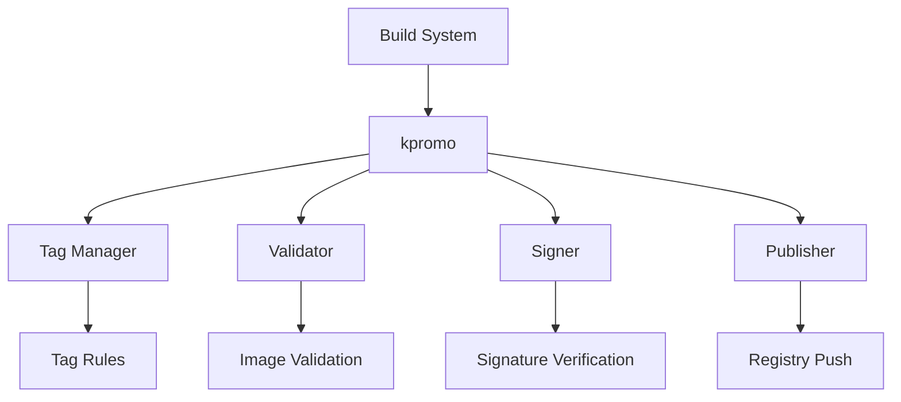

# The Invisible Rewrite: Modernizing the Kubernetes Image Promoter

## ① 背景与问题（解决了什么痛点）

在 Kubernetes 的生态系统中，容器镜像的管理是一个至关重要的环节。每一个你从 `registry.k8s.io` 拉取的镜像，都离不开一个名为 `kpromo` 的工具——Kubernetes Image Promoter。它负责将构建好的镜像推送到官方镜像仓库，并确保其符合 Kubernetes 的发布标准。

然而，随着 Kubernetes 生态系统的不断扩展，原有的 `kpromo` 工具逐渐暴露出一些瓶颈：

- **性能瓶颈**：旧版 `kpromo` 在处理大规模镜像推送时效率低下，导致发布流程延迟。
- **可维护性差**：代码结构复杂，依赖关系混乱，使得新功能的开发和故障排查变得困难。
- **缺乏灵活性**：无法灵活支持多版本镜像、标签策略等高级特性。
- **安全性不足**：缺少对镜像签名、校验等安全机制的支持。

为了解决这些问题，Kubernetes 社区启动了 `kpromo` 的重写项目，目标是打造一个更高效、更灵活、更安全的镜像推广系统。

---

## ② 核心概念/技术原理

### 2.1 什么是 Image Promoter？

Image Promoter 是 Kubernetes 用于将构建好的容器镜像推送到 `registry.k8s.io` 的自动化工具。它不仅负责镜像的推送，还涉及镜像的版本控制、标签管理、元数据处理等。

### 2.2 新版 kpromo 的核心组件

新版 `kpromo` 采用模块化设计，主要包括以下几个核心组件：

| 组件 | 功能 |
|------|------|
| `promote` | 镜像推送的核心逻辑 |
| `tagger` | 标签管理模块 |
| `validator` | 镜像验证模块 |
| `signer` | 镜像签名模块 |
| `publisher` | 镜像发布到 registry 的接口 |

### 2.3 技术架构图



### 2.4 关键技术点

- **模块化架构**：每个组件独立运行，便于扩展和维护。
- **标签策略配置化**：通过 YAML 文件定义标签规则，提高灵活性。
- **镜像签名支持**：集成 OpenPGP 或 Sigstore 签名机制，提升安全性。
- **并行推送优化**：使用并发模型提升推送效率。
- **日志与监控集成**：支持 Prometheus 和 Grafana 监控指标。

---

## ③ 实战案例/代码示例（重点章节）

### 3.1 安装新版 kpromo

#### 3.1.1 安装依赖

首先，确保你的环境中已安装以下依赖：

```bash
sudo apt-get install -y git curl python3-pip
```

然后，克隆 `kpromo` 项目：

```bash
git clone https://github.com/kubernetes-sigs/promo-tools.git
cd promo-tools
```

#### 3.1.2 安装 Python 依赖

```bash
pip3 install -r requirements.txt
```

#### 3.1.3 构建镜像

```bash
make build
```

这会生成一个可执行文件 `kpromo`，你可以将其加入到 `PATH` 中以便全局使用。

### 3.2 配置标签策略

新版 `kpromo` 使用 YAML 文件定义标签策略。例如，创建一个 `tagging-config.yaml` 文件：

```yaml
# tagging-config.yaml
tags:
  - name: "latest"
    pattern: "v{{version}}"
    prefix: "k8s.gcr.io"
  - name: "stable"
    pattern: "v{{version}}-stable"
    prefix: "k8s.gcr.io"
```

这个配置表示：对于每个版本号，生成两个标签：`latest` 和 `stable`。

### 3.3 推送镜像

假设你有一个本地构建的镜像 `my-image:v1.0`，你想将其推送到 `registry.k8s.io`，可以使用如下命令：

```bash
kpromo promote \
  --image my-image:v1.0 \
  --registry registry.k8s.io \
  --config tagging-config.yaml
```

该命令会根据 `tagging-config.yaml` 中的规则，自动为 `my-image:v1.0` 生成多个标签并推送到目标 registry。

### 3.4 验证镜像

为了确保镜像被正确推送，可以使用 `kpromo validate` 命令进行验证：

```bash
kpromo validate \
  --image my-image:v1.0 \
  --registry registry.k8s.io
```

如果验证成功，你会看到类似如下的输出：

```text
✅ Image my-image:v1.0 is valid and exists in registry.k8s.io.
```

### 3.5 配置签名（可选）

如果你希望对镜像进行签名以增强安全性，可以使用 `kpromo signer` 模块。首先，你需要准备一个签名密钥：

```bash
gpg --gen-key
```

然后，在 `signing-config.yaml` 中配置签名规则：

```yaml
# signing-config.yaml
signers:
  - name: "default"
    key-id: "your-key-id"
    algorithm: "sha256"
```

最后，使用 `kpromo sign` 命令进行签名：

```bash
kpromo sign \
  --image my-image:v1.0 \
  --config signing-config.yaml
```

### 3.6 查看镜像信息

你可以使用 `kpromo info` 命令查看镜像的详细信息，包括标签、签名状态等：

```bash
kpromo info \
  --image my-image:v1.0 \
  --registry registry.k8s.io
```

输出结果可能如下：

```text
Image: my-image:v1.0
Tags:
  - latest
  - stable
Signatures:
  - default (valid)
```

---

## ④ 架构设计/方案对比

### 4.1 旧版 kpromo vs 新版 kpromo

| 特性 | 旧版 kpromo | 新版 kpromo |
|------|-------------|-------------|
| 架构 | 单体应用 | 模块化架构 |
| 扩展性 | 差 | 强 |
| 性能 | 低 | 高 |
| 可维护性 | 差 | 好 |
| 安全性 | 一般 | 强（支持签名） |
| 配置方式 | 代码硬编码 | YAML 配置 |
| 并发支持 | 无 | 支持并发推送 |
| 日志监控 | 有限 | 支持 Prometheus |

### 4.2 其他替代方案对比

除了 `kpromo`，还有其他一些镜像推广工具，比如：

- **Docker Registry API**：虽然强大，但需要手动实现镜像推送逻辑。
- **Helm**：主要用于包管理，不适用于镜像推广。
- **Skopeo**：用于镜像复制和转换，不适用于自动化发布流程。

| 工具 | 适用场景 | 优势 | 劣势 |
|------|----------|------|------|
| kpromo | Kubernetes 官方镜像推广 | 自动化、标准化 | 学习曲线较陡 |
| Skopeo | 镜像复制、转换 | 灵活、轻量 | 缺乏发布逻辑 |
| Docker Registry API | 自定义镜像推送 | 完全控制 | 需要自行实现逻辑 |

### 4.3 最佳实践建议

- **优先使用新版 kpromo**：特别是 Kubernetes 官方项目，推荐使用新版以获得更好的支持和性能。
- **配置化管理标签策略**：避免硬编码标签规则，提高灵活性。
- **启用镜像签名**：提升镜像的安全性，防止篡改。
- **监控推送过程**：集成 Prometheus 监控，及时发现异常。
- **定期更新镜像**：保持镜像的最新状态，减少安全隐患。

---

## ⑤ 优劣势评估/选型建议

### 5.1 优势分析

- **模块化设计**：便于扩展和维护，适合长期运维。
- **高性能**：支持并发推送，提升发布效率。
- **配置化管理**：通过 YAML 文件管理标签规则，提高灵活性。
- **安全性增强**：支持镜像签名，保障镜像来源可信。
- **社区支持强**：作为 Kubernetes 官方工具，有完善的文档和社区支持。

### 5.2 劣势分析

- **学习成本高**：相比旧版，新版 `kpromo` 的配置和使用方式有一定变化。
- **部署复杂度增加**：需要额外配置签名、监控等组件。
- **依赖较多**：需要安装 Python、GPG 等依赖项。

### 5.3 选型建议

| 场景 | 推荐方案 |
|------|-----------|
| Kubernetes 官方镜像发布 | ✅ 新版 kpromo |
| 小规模镜像管理 | ✅ Skopeo + 自定义脚本 |
| 企业级镜像发布 | ✅ 新版 kpromo + Prometheus 监控 |
| 开发环境测试 | ✅ Skopeo 或 Docker Registry API |

---

## ⑥ 总结与延伸

新版 `kpromo` 的推出标志着 Kubernetes 在镜像管理方面的进一步成熟。它不仅解决了旧版工具的性能和可维护性问题，还引入了更强大的标签管理、镜像签名等特性，提升了整个镜像发布流程的安全性和效率。

对于 Kubernetes 用户来说，掌握新版 `kpromo` 的使用方法，是提升镜像发布能力的关键一步。通过合理的配置和最佳实践，可以显著降低镜像管理的复杂度，提高发布效率。

未来，随着 Kubernetes 生态的持续发展，`kpromo` 也将不断迭代，支持更多高级功能，如多集群镜像同步、镜像生命周期管理等。我们期待看到更多的开发者参与到这一过程中，共同推动 Kubernetes 的生态繁荣。

> **延伸阅读**：
- [Kubernetes 官方文档](https://kubernetes.io/docs/)
- [kpromo GitHub 项目](https://github.com/kubernetes-sigs/promo-tools)
- [OpenPGP 与 Sigstore 签名指南](https://sigstore.dev/)
- [Prometheus 监控集成教程](https://prometheus.io/docs/introduction/overview/)
