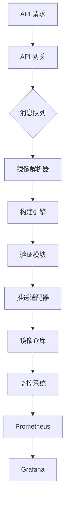

# The Invisible Rewrite: Modernizing the Kubernetes Image Promoter

## ① 背景与问题（解决了什么痛点）

在 Kubernetes 生态中，容器镜像的管理是一个关键环节。无论是开发、测试还是生产环境，镜像的构建、推送、拉取和版本控制都直接影响到系统的稳定性和可维护性。而 `kpromo`，作为 Kubernetes 官方镜像推广工具，承担了将镜像从源仓库推送到 `registry.k8s.io` 的核心职责。

然而，随着 Kubernetes 社区的快速扩展，原有的 `kpromo` 工具逐渐暴露出一些问题：

- **性能瓶颈**：旧版 `kpromo` 在处理大规模镜像时效率低下，导致推送延迟。
- **灵活性不足**：原有架构难以支持多分支、多版本的镜像管理需求。
- **可观测性差**：缺乏完善的日志和监控机制，使得故障排查困难。
- **部署复杂**：依赖复杂的 CI/CD 流程，配置繁琐，不易集成到现代 DevOps 流水线中。

这些问题不仅影响了镜像推送的效率，也限制了 Kubernetes 社区对镜像管理的自动化能力。因此，Kubernetes 团队决定对 `kpromo` 进行重构，以解决上述痛点，提升镜像管理的稳定性、可扩展性和易用性。

## ② 核心概念/技术原理

### 什么是 `kpromo`？

`kpromo` 是一个用于自动化将容器镜像从源仓库（如 GitHub）推送到 Kubernetes 官方镜像仓库（`registry.k8s.io`）的工具。它通过解析镜像标签、构建镜像、验证镜像内容，并最终将其推送到目标仓库。

### 新版 `kpromo` 的核心变化

新版 `kpromo` 基于 Go 语言重新实现，引入了以下关键技术改进：

- **模块化设计**：将镜像推送流程拆分为多个独立组件，便于扩展和维护。
- **异步处理**：采用异步任务队列（如 Kafka 或 Redis）来处理镜像推送请求，提高吞吐量。
- **增强的验证机制**：增加了对镜像签名、完整性校验的支持，确保推送的镜像安全可靠。
- **轻量级 API 网关**：提供 RESTful 接口供外部系统调用，便于与其他系统集成。
- **统一的日志和监控系统**：集成 Prometheus 和 Grafana，提供实时监控和报警功能。

### 技术栈概览

```
┌───────────────────────┐
│     kpromo v2.0       │
├───────────────────────┤
│  1. 镜像解析器        │
│  2. 构建引擎          │
│  3. 验证模块          │
│  4. 推送适配器        │
│  5. API 网关          │
│  6. 日志与监控系统    │
└───────────────────────┘
```

每个模块都可以独立运行，也可以通过消息队列进行通信，形成一个完整的镜像推送流水线。

## ③ 实战案例/代码示例

### 场景描述

假设你正在为 Kubernetes 官方项目编写一个新的控制器（Controller），需要将构建好的镜像推送到 `registry.k8s.io`。你可以使用新版 `kpromo` 来自动化这一过程。

### 准备工作

#### 安装依赖

首先，你需要安装 `kpromo` 的 CLI 工具。可以通过 Go 安装：

```bash
go install github.com/kubernetes-sigs/promo-tools/cmd/kpromo@latest
```

或者从官方发布页面下载二进制包。

#### 配置文件

创建一个 `config.yaml` 文件，定义推送规则：

```yaml
image:
  name: "my-controller"
  tag: "v1.0.0"
  registry: "registry.k8s.io"
  namespace: "k8s.gcr.io"

build:
  type: "docker"
  dockerfile: "Dockerfile"
  context: "./controller"

validate:
  signature: true
  checksum: true

push:
  parallel: 4
  timeout: "300s"
```

#### 启动服务

启动 `kpromo` 服务，监听推送请求：

```bash
kpromo serve --config config.yaml
```

### 实际推送操作

当你完成镜像构建后，可以使用以下命令触发推送：

```bash
kpromo push my-controller:v1.0.0
```

该命令会自动执行以下步骤：

1. 解析镜像信息
2. 检查本地是否已有该镜像
3. 如果没有，根据 Dockerfile 构建镜像
4. 对镜像进行签名和校验
5. 将镜像推送到 `registry.k8s.io`

### 示例：自定义推送脚本

如果你希望将 `kpromo` 集成到 CI/CD 流程中，可以编写一个简单的 Bash 脚本：

```bash
#!/bin/bash

# 设置环境变量
export KPROMO_CONFIG="config.yaml"

# 构建镜像
docker build -t my-controller:v1.0.0 -f Dockerfile .

# 推送镜像
kpromo push my-controller:v1.0.0
```

### 自定义 API 调用

如果你希望通过 HTTP API 触发推送，可以使用如下 curl 命令：

```bash
curl -X POST http://localhost:8080/push \
     -H "Content-Type: application/json" \
     -d '{"image": "my-controller:v1.0.0"}'
```

### 验证推送结果

推送完成后，可以访问 [https://registry.k8s.io](https://registry.k8s.io) 查看镜像是否成功上传。

## ④ 架构设计/方案对比

### 新版 `kpromo` 架构图



### 与旧版 `kpromo` 的对比

| 特性 | 旧版 `kpromo` | 新版 `kpromo` |
|------|---------------|----------------|
| 架构 | 单体应用 | 分布式微服务 |
| 处理方式 | 同步阻塞 | 异步非阻塞 |
| 可扩展性 | 低 | 高 |
| 部署方式 | 本地脚本 | Docker/K8s 部署 |
| 监控支持 | 无 | Prometheus + Grafana |
| 验证机制 | 基础 | 签名 + 校验 |
| API 支持 | 有限 | 完整 RESTful API |

### 与第三方工具对比（如 Skopeo, Buildah）

| 工具 | 是否支持镜像推送 | 是否支持多版本管理 | 是否支持签名验证 | 是否支持 API 接口 |
|------|------------------|--------------------|------------------|---------------------|
| `kpromo` | ✅ | ✅ | ✅ | ✅ |
| Skopeo | ✅ | ❌ | ✅ | ❌ |
| Buildah | ✅ | ❌ | ❌ | ❌ |

可以看出，`kpromo` 在镜像推送的完整性和自动化方面具有明显优势，尤其适合 Kubernetes 官方镜像的管理和分发。

## ⑤ 优劣势评估/选型建议

### 优势分析

- **高度自动化**：支持从镜像构建到推送的全流程自动化。
- **安全性强**：支持镜像签名和校验，保障镜像来源可信。
- **可扩展性强**：模块化设计允许按需扩展或替换组件。
- **易于集成**：提供 RESTful API，便于与 CI/CD 流水线集成。
- **可观测性好**：内置监控和日志系统，便于运维和调试。

### 劣势分析

- **学习成本较高**：相比 Skopeo 或 Buildah，`kpromo` 的配置和使用相对复杂。
- **部署门槛高**：需要熟悉 Docker 和 Kubernetes 生态，不适合新手直接使用。
- **资源占用较大**：由于引入了消息队列和监控系统，对服务器资源有一定要求。

### 选型建议

- **推荐场景**：
  - Kubernetes 官方项目或社区镜像管理
  - 企业内部镜像仓库的自动化推送
  - 需要镜像签名和校验的高安全性场景

- **不推荐场景**：
  - 个人项目或小型团队的简单镜像管理
  - 无需签名和校验的临时镜像推送
  - 资源受限的边缘设备或嵌入式系统

### 最佳实践

- **统一配置管理**：将 `config.yaml` 作为配置中心，避免硬编码。
- **使用 Helm 部署**：将 `kpromo` 打包为 Helm Chart，方便在 Kubernetes 集群中部署。
- **定期清理旧镜像**：防止镜像仓库臃肿，建议设置自动清理策略。
- **启用签名验证**：在生产环境中强制开启镜像签名验证，防止恶意镜像注入。

## ⑥ 总结与延伸

### 总结

新版 `kpromo` 的推出，标志着 Kubernetes 镜像管理进入了一个更高效、更安全、更灵活的新阶段。通过模块化设计、异步处理和增强的验证机制，`kpromo` 不仅解决了原有工具的性能瓶颈，还提升了整个镜像推送流程的可靠性。

对于开发者而言，掌握 `kpromo` 的使用方法和最佳实践，是提升 Kubernetes 项目交付质量和运维效率的重要一步。

### 延伸思考

未来，随着 AI 和自动化技术的发展，`kpromo` 可能进一步融合以下能力：

- **AI 驱动的镜像优化**：通过机器学习预测镜像的使用频率，动态调整镜像存储策略。
- **智能镜像推荐**：基于用户行为数据，推荐最合适的镜像版本。
- **零信任安全架构**：结合零信任模型，强化镜像推送的安全性。

如果你正在参与 Kubernetes 项目，不妨尝试使用 `kpromo` 替代传统镜像推送方式，体验其带来的效率提升和安全保障。

---

> 📝 **作者简介**：千吉，专注于云原生技术与 DevOps 实践，致力于推动 Kubernetes 生态的现代化与自动化。
